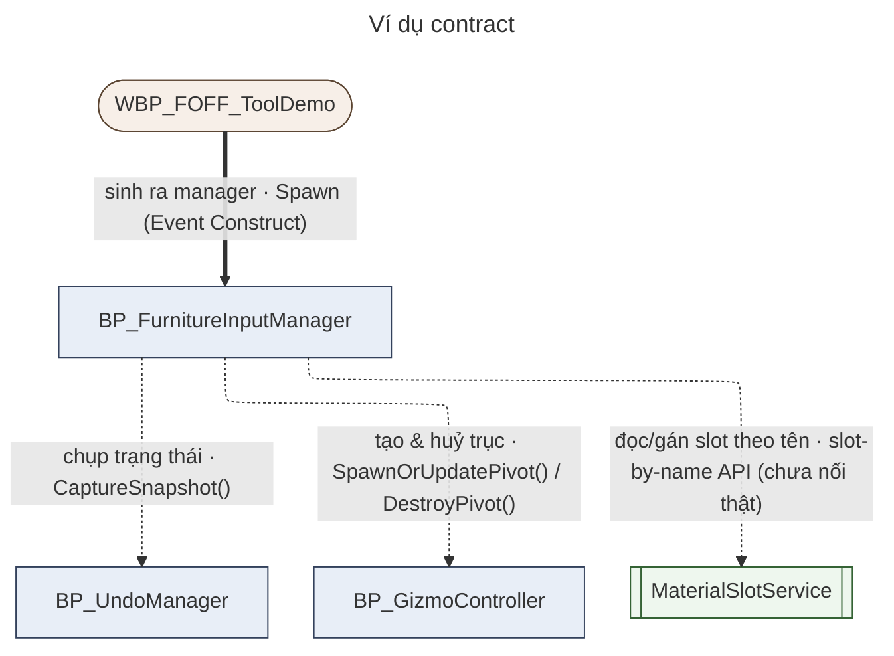

# Diagram Contract — Architecture_Map (UE5 Interior Tool)

Quy ước trình bày project-specific cho `Architecture_Map.md`. KHÔNG chứa Mermaid syntax manual — cú pháp dùng skill `mermaid`.

Nguyên tắc gốc: **line style + text tự diễn đạt được trạng thái.** Màu sắc chỉ là lớp phụ, không bao giờ là nguồn thông tin duy nhất (in đen trắng vẫn phải đọc được).

---

## 0. Tiêu chí đưa node vào bản đồ

Bản đồ KHÔNG xét component lớn/nhỏ, chỉ xét **có nằm trên đường giao tiếp của code không**.

- **Asset thật** + có **Event / Function / Dispatcher / Reference** nối sang component khác → **đưa vào** (node).
- Chỉ là **widget variable / container thuần**, không có logic riêng → **không** node riêng.
- Asset thật nhưng chưa có canonical doc → vẫn đưa vào, nhãn `(no doc)`, liệt kê ở Phần 0.4 để cuhoang chốt.

---

## 1. Node type (shape)

| Type | Mermaid shape | Ví dụ |
|---|---|---|
| Blueprint (BP_) | `["BP_Name"]` bo vuông | `["BP_FurnitureInputManager"]` |
| Widget (WBP_) | `(["WBP_Name"])` bo tròn viên thuốc | `(["WBP_FurnitureInventory"])` |
| C++ Service / Library | `[["Name"]]` subroutine (vạch đôi) | `[["MaterialSlotService"]]` |
| Data Asset / Struct / Enum | `[("Name")]` cylinder | `[("DT_FurnitureCatalog")]` |
| External / project tổng | `>"Name"]` cờ | `>"Foff_GameInstance"]` |

`classDef` màu chỉ để nhìn nhanh — không mang nghĩa. Shape mới là nguồn phân loại.

---

## 2. Evidence state → line style

| State | Line | Nghĩa |
|---|---|---|
| verified | `==>` **nét dày** | canonical doc nói `✓K2Node` / `verified qua K2` cho quan hệ đó (hoặc có K2 export trực tiếp) |
| documented | `-.->` **nét đứt** | doc mô tả flow nhưng KHÔNG nói K2 — "chưa chắc, chờ K2" |
| unknown | `-.->` nét đứt + nhãn `?` | doc không đủ, đang chờ evidence |

Nét dày = CHỈ khi doc khẳng định K2 (hoặc có export). Không có ngoại lệ.
Mỗi sơ đồ kết bằng 1 dòng **`Kiểm chứng K2:`** liệt kê edge nào dày + ngày; phần còn lại "theo doc".

---

## 3. Nhãn mũi tên — song ngữ (dễ hiểu + jargon)

Nhãn = **câu tiếng Việt** (người cơ bản đọc hiểu) + `·` + **tên thật** (Function/Dispatcher/Var) + loại tiếng Anh khi cần.
KHÔNG suy ra loại quan hệ từ arrowhead.

| Câu tiếng Việt | Jargon EN | Nghĩa kỹ thuật |
|---|---|---|
| tạo … | `Create Widget` / `Spawn Actor` | dựng ra 1 widget/actor mới |
| tạo & huỷ … | own lifecycle | tạo + giữ + dọn khi xong |
| gọi `Foo()` | `call function/event` | ra lệnh cho bên kia chạy 1 hàm |
| nghe `OnBar` | `Bind Event to dispatcher` | đăng ký để được gọi lại khi bên kia phát sự kiện |
| báo tin `OnBar` | `Broadcast dispatcher` | phát sự kiện cho mọi bên đang nghe |
| giữ tham chiếu `X` | `object reference variable` | giữ "địa chỉ" bên kia để dùng lại |
| đọc / đọc-ghi `X` | `GET` / `SET variable` | lấy hoặc đặt giá trị biến của bên kia |
| ép kiểu → `T` | `Cast To` | kiểm tra & chuyển 1 object sang lớp cụ thể |
| chụp trạng thái | `CaptureSnapshot()` | lưu mốc để Undo quay lại |

Với quan hệ **gọi hàm** luôn ghi tên Function/Event/Dispatcher thật.
1 mũi tên có nhiều việc → gộp: `tạo menu + gọi đóng · Create + Hide()`.

---

## 4. Kế thừa (inheritance)

Hệ phân cấp project phẳng (hầu hết off `Actor`/`UserWidget`) → KHÔNG vẽ mũi tên "→ Actor".
Chỉ ghi bảng "Kế thừa / clone đáng ghi nhận": parent lệch chuẩn (DEVIATION), clone-from, superseded-by, sibling. Mức `[DOC]` tới khi K2.

---

## 5. Source traceability

Mỗi component quan trọng phải trace được về canonical source file (Phần 4 Index Map).
Component không có canonical doc riêng → `(no doc)` trong node + liệt kê Phần 0.4. KHÔNG tự tạo doc.

---

## 6. Conflict

2 source mâu thuẫn về path/type/relationship của cùng 1 component:
- KHÔNG tự chọn.
- Giữ line ở state thấp hơn (thường nét đứt).
- Ghi 1 dòng `CONFLICT:` / `⚠` ngay dưới diagram nêu cả 2 nguồn.

---

## 7. Layout + frontmatter mỗi sơ đồ

- Layout **ELK** (ít giao cắt hơn dagre), hướng **TB**.
- Gom node liên quan vào `subgraph` theo mảng chức năng — subgraph là NHÓM, không phải quan hệ.
- Mỗi sơ đồ có frontmatter `title` + config ELK, để khi copy sang mermaid.live / excalidraw vẫn mang tiêu đề:

```
---
title: "3a — Chọn đồ · Gizmo · Nhóm"
config:
  flowchart:
    defaultRenderer: elk
---
flowchart TB
```

---

## 8. Ví dụ (mẫu — không phải quan hệ thật)



Đọc: chỉ `TD → IM` đã kiểm chứng K2 (nét dày). Ba mũi tên còn lại nét đứt — mới theo doc, chờ K2.
`Kiểm chứng K2:` `TD→IM` (2026-08-28). Còn lại: theo doc.
