# Architecture Map — UE5 Interior Tool

**Phiên bản:** 1.20 | **Cập nhật:** 25/09/2026 11:00 — `OnLMBReleased` do Enhanced Input `IA_LeftRelease` gọi (Find References 25/09) → 5a, 5d, 5j ghi rõ; 5d đóng `?` (3): 2 handler lúc thả thuộc 2 hệ input, thứ tự không cam kết, logic không phụ thuộc.

**Phiên bản:** 1.19 | **Cập nhật:** 25/09/2026 10:55 — K2 IM Input Key LMB (Pressed + Released) 25/09: 5d bước bấm/thả sang nét liền, đóng `?` (2) (`bIsDraggingGizmo` = `GizmoControllerRef.bIsDraggingGizmo`); 3a `IM→GIZMO` nâng `==>`; 5a thêm bước menu chuột phải nuốt lượt bấm.

**Phiên bản:** 1.18 | **Cập nhật:** 25/09/2026 10:40 — K2 `CB_SaveCombo_Handler` 25/09: đóng CONFLICT 5q — `ResolveActiveComboForSave()` có thật (sau guard inventory), 3 tham số xuống `OpenSaveComboDialog`.

**Phiên bản:** 1.17 | **Cập nhật:** 25/09/2026 10:30 — K2 `WBP_FOFF_ToolDemo` Event Construct Then 11: đóng CONFLICT 5g (widget sinh manager, không phải Level BP); cạnh `TOOLDEMO→IM/UNDO/SCENE/COMBO/PREFS/TOAST` nâng `==>`; ToastRef gán vào SceneManager (không phải GI) — ghi `?` cho các chỗ còn ghi `GI.ToastRef`.

**Phiên bản:** 1.16 | **Cập nhật:** 25/09/2026 10:15 — 5j: fix Bug-BoxSelectCtrl-MultiSnapshot → 1 mốc BoxSelect cho cả 2 nhánh (PIE PASS).

**Phiên bản:** 1.15 | **Cập nhật:** 25/09/2026 10:05 — K2 `FinishBoxSelect` 25/09: 5j đóng CONFLICT (quét khung CÓ `ExpandSelectionWithGroups`), thân hàm nét liền; 3a tách cạnh `IM==>UNDO CaptureSnapshot(BoxSelect)`; ghi nghi vấn Ctrl = N mốc BoxSelect.

**Phiên bản:** 1.14 | **Cập nhật:** 25/09/2026 09:40 — K2 Inventory Event Construct 25/09: Bind `UndoManagerRef.OnHistoryChanged → Handle_HistoryChanged → RefreshParamPanel` ✓ → cặp `UNDO↔INV` (OnHistoryChanged) nâng `==>` ở 3d; 5b, 5d mũi tên báo tin nét liền (5c giữ đứt: broadcast ở nhánh Undo/Redo chưa K2).

**Phiên bản:** 1.13 | **Cập nhật:** 25/09/2026 09:35 — `AppendEntry` ✓K2 25/09 → 5d bước "đưa vào sổ" nét liền; phía Inventory nghe `OnHistoryChanged` chờ K2.

**Phiên bản:** 1.12 | **Cập nhật:** 25/09/2026 09:30 — Đóng `?` bằng tra cứu + PIE của cuhoang: Ctrl+G / Ctrl+Shift+G = `IA_GroupCreate` / `IA_Ungroup` trong InputManager (5l); lưu / mở cảnh qua menu Save/Load (phím **M**), KHÔNG có Ctrl+S; sổ Undo KHÔNG xoá khi Load (5t).

**Phiên bản:** 1.11 | **Cập nhật:** 25/09/2026 09:10 — **Sửa drift Input (Gate 1.5 B2):** Input Action nội thất nằm trong `BP_FurnitureInputManager` (BeginPlay `AddMappingContext` ✓K2 25/09), không qua `BP_FoffPlayerController` → bỏ `PC` khỏi 3a/3c/3d, 5c/5g/5k/5m vẽ lại từ IM. +guard `IsGizmoDragging` (Undo/Redo bỏ qua khi đang kéo gizmo, PIE PASS) ở 5c/5f.

**Phiên bản:** 1.10 | **Cập nhật:** 25/09/2026 08:50 — `OnMouseReleased` F2 phần A: kẹt cờ khi Ctrl+Z giữa lúc kéo đã sửa (PIE PASS) — cập nhật ⚠ 5f.

**Phiên bản:** 1.9 | **Cập nhật:** 25/09/2026 08:25 — `BP_GizmoController.OnMouseReleased`: nhánh "Scale" đã sửa 25/09 — Branch 2 so `ActiveMode == Scale`, PIE PASS 3/3 — cập nhật ghi chú 3a / 3d / 5d / 5f (không đổi mũi tên).

**Phiên bản:** 1.8 | **Cập nhật:** 25/09/2026 — Phần 5: +14 luồng thao tác **5g–5t** (mở tool & kho · tìm đồ · kéo đồ vào phòng · quét chọn · nhích phím · nhóm & sửa nhóm · menu chuột phải · thay đồ · đổi vật liệu 2 cách · lưu / đặt / thay combo · lưu & mở cảnh) — rút từ doc canonical, liền chỉ ở chỗ doc ghi ✓K2. Phần 3: +cạnh cho khớp (lint ❌/⚠ = 0), nâng K2 các cạnh đã có bằng chứng (`IM→INV` EnterReplaceMode 24/07 + OpenSaveComboDialog 04/08, `DRAGOV→MSS/FA/SCENE` nhánh Material 11/09, `INV→PREFS` AddRecentMaterial 05/09, `MESHCTRL→IM` BTN_Replace 24/07). Nhãn `CaptureSnapshot` ghi rõ tên entry để lint phân biệt. Mỗi luồng có note hành trình ở `Brain/Luồng/`.

**Phiên bản:** 1.7 | **Tạo:** 28/08/2026 15:59 | **Cập nhật:** 24/09/2026 20:35 — Sửa lệch Phần 3 ↔ Phần 5 (bắt bằng `Brain/_tools/build.py`): +6 cạnh thiếu (3a ×4, 3d `UNDO→IM`/`IM→FA`, 3e `FA→MSS`), nâng K2 cạnh đã có bằng chứng (`UNDO→SCENE`, `UNDO→MSS`, `UNDO→FA` RowName, `PSROW/PCROW→INV` OnPreviewChanged), sửa cạnh sai đích `UNDO→FA SpawnFurnitureCopy` → `UNDO→IM`. K2 `BP_GizmoController.OnMouseReleased` (24/09) → nâng `GIZMO→IM`, `GIZMO→UNDO`, 5d, 5f. 5e tách mũi tên trộn bằng chứng (CONFLICT PersistentID). Render PASS.

**Phiên bản:** 1.6 | **Cập nhật:** 24/09/2026 19:20 — Phần 5: +**5f Kéo gizmo Move** (1 món · ≥2 món qua Pivot, từ bấm nút Move tới CaptureSnapshot). Cả luồng theo doc (chưa cạnh nào ✓K2), 3 điểm `?`. Render PASS (mermaid-cli).

**Phiên bản:** 1.5 | **Cập nhật:** 24/09/2026 19:15 — Phần 5: 5c viết lại (phím **Ctrl+Z / Ctrl+Shift+Z**, trước ghi nhầm Alt+Z) + **5d Ghi sổ (CaptureSnapshot)** + **5e RestoreSnapshot chi tiết** (3 nhịp thời gian sau Undo). Render PASS.

**Phiên bản:** 1.4 | **Cập nhật:** 24/09/2026 18:55 — +**Phần 5 — Luồng runtime** (3 `sequenceDiagram`: 5a Click chọn đồ · 5b Chỉnh thông số U2 · 5c Undo/Redo) theo skill `arch-map` §5 + diagram-contract (liền=✓K2, đứt=theo doc). Render PASS (mermaid-cli).

**Phiên bản:** 1.3 | **Cập nhật:** 24/09/2026 16:10 (U2.4/U2.5, Interactive Edit Session)
— Sơ đồ 3d: +`INV→UNDO` (Begin/Commit/Cancel session), +`UNDO→SCENE` (`ResolveByPersistentId` — Resolver U1 có
caller THẬT đầu tiên), +`UNDO→INV` (`Broadcast OnHistoryChanged`), +`INV→UNDO` bind `OnHistoryChanged`, +`UNDO→MSS`
(đọc Before/After + áp command). Sơ đồ 3e: seed row đổi nguồn sang `MSS.GetSlot*Param`, +cạnh `OnEditBegin`
row→INV. Tất cả `[DOC]` + PIE-verify, CHƯA K2.

**Phiên bản:** 1.2 | **Cập nhật:** 21/09/2026 (U1, PersistentIdentity)
— +1 asset mới `UEntityIdLibrary` (§0.3, gia phả §2, `[[C++]]` shape) — GUID-string ổn định cho
actor. Sơ đồ 3c (Inventory): +1 cạnh `DRAGOV→EIL` (`On Drop` producer thứ 4). Sơ đồ 3d (Save·Undo):
+2 cạnh mới `FA→EIL`/`IM→EIL` (`EnsurePersistentId`) + mở rộng nhãn cạnh `UNDO→FA` có sẵn (thêm
`SET PersistentID`, guarded inject). `IM→EIL` nâng `[K2 2026-09-21]` (SpawnFurnitureCopy export
thật); còn lại `[DOC]`/PIE-verify. `BP_FurnitureSceneManager` +hàm `ResolveByPersistentId`
(✓K2 21/09) — CHƯA có caller, không vẽ cạnh (dự kiến nối U3).

**Phiên bản:** 1.1 | **Tạo:** 28/08/2026 15:59 | **Cập nhật:** 18/09/2026 (S7G7T3.3+T3.4) — sơ đồ
3e (Vật liệu): 4 cạnh mới `INV→UMPM`/`INV→MINSPECT`/`INV→PSROW`/`INV→PCROW` nâng
**[K2 2026-09-18]** (`RefreshParamPanel()` build đầy đủ, K2Node export thật) — thay 2 cạnh
"CHƯA WIRE" của v1.0; +1 cạnh mới `FA→INV` (`ApplyMaterialByRowName` X3, đường kéo-thả material
đồng bộ panel, `[DOC]`) | **Người dựng:** Claude Code (theo handoff Opus 22/08/2026)

> **v1.0 (17/09/2026, S7G7T1-T3):** +6 asset mới (`InteriorColorPicker`, `WBP_ParamScalarRow`,
> `WBP_ParamColorRow`, `WBP_MaterialParamPanel`, `WBP_MaterialInspector`, `UMaterialParamMap`) vào
> Phần 0/1/2/3e/4. Sơ đồ 3e vẽ lại với 2 cạnh `[DOC]` thật (`PCROW→ICP`, `PCROW→UMPM`) + 1 cạnh
> nội bộ node-verified (`MINSPECT→PPANEL`); cạnh `WBP_FurnitureInventory→WBP_MaterialInspector`
> CHƯA vẽ lúc đó (T3.3 còn đang xây).

> **v0.9 (12/09/2026, G6.1):** +1 cạnh `IM→INV` (`NotifyViewportSlotClick`, click-vào-mesh chọn
> slot) nâng `[K2 2026-09-12]`. GATE G6 ĐÓNG HẲN.

> **v0.8 (12/09/2026, G6.0 VERIFY):** +5 cạnh Selection/Click Resolution nâng `[K2 2026-09-12]` —
> xem delta "G6.0 As-Built: Click Resolution Flow (K2-Verified)" cùng ngày.

> **v0.7:** +3 BP: UserPreferencesSave, 2× DragDropOperation; FurnitureRowRef = dead. Cập nhật 29/08/2026 00:42.

> **DEVIATION so với handoff (cuhoang chỉ đạo 28/08/2026):** handoff gốc yêu cầu Phần 2/3 = khung rỗng, chỉ điền từ K2. cuhoang đổi: Claude Code ĐƯỢC rút quan hệ **từ mô tả flow trong canonical doc** — KHÔNG tự suy luận. Doc nói "✓K2Node" cho quan hệ đó → nét liền `[K2]`. Còn lại → nét đứt `[DOC]`. Claude Code vẫn KHÔNG được bịa quan hệ không có trong doc.
>
> **Trạng thái:** Phần 0 / 1 / 4 = TĨNH. Phần 2 / 3 = khung đầy đủ node; mũi tên rút dần từ doc + nâng cấp lên `[K2]` khi có export.
>
> **Nguồn:** quét `docs/Blueprints/` `docs/Widgets/` `docs/Data/` ngày 28/08/2026.
>
> **Quy ước trình bày:** xem `.claude/skills/arch-map/references/diagram-contract.md`.
> Tóm tắt: `-->` nét liền = K2/live verify · `-.->` nét đứt = chưa verify (kèm `?`) · `["BP"]` bo vuông · `(["WBP"])` bo tròn · `[["C++ Service"]]` vạch đôi · `[("Data")]` cylinder · nhãn evidence `[K2 YYYY-MM-DD]` / `[DOC]` / `[?]`.

---

## Tiêu chí đưa node vào bản đồ

Bản đồ KHÔNG xét component lớn/nhỏ, chỉ xét **có nằm trên đường giao tiếp của code không**.

- **Asset thật** + có **Event / Function / Dispatcher / Reference** nối sang component khác → **đưa vào** (dạng node).
- Chỉ là **widget variable / container thuần**, không có logic riêng → **không** node riêng.

---

## Phần 0 — Danh sách asset (nền cho mọi phần)

Chỉ liệt kê asset THẬT (có canonical doc riêng hoặc version history). Cột **Parent** lấy từ header canonical doc — mức `[DOC]`, CHƯA K2.

### 0.1 — Blueprints có canonical doc (11)

| Blueprint | Parent (theo doc, `[DOC]`) | Chức năng chính (1 dòng) |
|---|---|---|
| `BP_FurnitureInputManager` | Actor | Core hub — input · multi-select · box-select · context-menu · group · edit-mode |
| `BP_UndoManager` | Actor | Undo/Redo stack — `S_SceneSnapshot` V4 + EditModeStack |
| `BP_ComboManager` | Actor | Combo logic — save / spawn / replace (Sprint 5); nhận data qua param (R2) |
| `BP_FurnitureSceneManager` | Actor | EMS Save/Load; spawn/destroy furniture actor theo catalog |
| `BP_FurnitureUserPrefsManager` | Actor *(cuhoang xác nhận 28/08/2026)* | UserPrefs Favorite/Recent combo — persist qua EMS SaveGame |
| `BP_GizmoController` | Actor | Gizmo movement logic — TransformMode, axis drag, ray-plane, snap |
| `BP_PivotActor` | StaticMeshActor *(DEVIATION T3)* | Pivot vô hình cho multi-gizmo move/rotate/scale |
| `BP_FurnitureActor` | StaticMeshActor · impl `EMSActorSaveInterface` | Từng đồ nội thất trong scene — SaveGame vars (MeshPath/RowName/MaterialOverrides) |
| `BP_ComboGhostActor` | Actor | Ghost preview bounding-box của combo trong lúc drag |
| `BP_ComboItemView` | Object *(không Actor)* | Bọc `FComboData` thành UObject cho `CTV_ComboCard` (TileView tab Combo) |
| `BP_FoffPlayerController` | Player Controller *(project tổng)* | Add/Remove `LM_FurnitureInput` Mapping Context + bind Enhanced Input Undo/Redo |

### 0.2 — Widgets có canonical doc (19)

| Widget | Chức năng chính (1 dòng) |
|---|---|
| `WBP_FurnitureInventory` | Inventory chính — filter · search · folder tree · pagination · Material Editor (v1.1) · Resize · Replace |
| `WBP_MeshControls` | Persistent toolbar — Move/Rotate/Scale/Delete · info bar · edit-mode breadcrumb |
| `WBP_ResizeWindow` | Resize 8 hướng cho `WBP_FurnitureInventory` (logic-only feature doc) |
| `WBP_BoxSelectOverlay` | Khung rubber-band box-select — chỉ HIỂN THỊ, logic ở `BP_FurnitureInputManager` |
| `WBP_DetailPopup` | Popup thông tin sản phẩm + Scale editor |
| `WBP_FurnitureCard` | Card 1 mặt hàng nội thất — `IUserObjectListEntry`, nhận `BP_FurnitureItemView` từ ListView |
| `WBP_ComboCard` | Card 1 combo trong tab Combo — `IUserObjectListEntry`, nhận `BP_ComboItemView` từ `CTV_ComboCard` |
| `WBP_DragOverlay` | Overlay drag & drop khi kéo `WBP_FurnitureCard` — doc chung ở `WBP_DragOverlay_FurnitureCard.md` (kèm nội dung `WBP_FurnitureCard` legacy pre-D.T6) |
| `WBP_TreeNode` | Node 1 cấp folder trong cây của `WBP_FurnitureInventory` |
| `WBP_ChipTag` | Chip 1 folder con trong breadcrumb area — chứa trong `WBP_ChipRow` |
| `WBP_EditableLabel` | Component inline-rename tái dùng (Content Browser style) |
| `WBP_FolderTreePicker` | Lớp-2 shared tree picker — nhúng vào Move/Save dialog |
| `WBP_FolderPickerRow` | Row của `WBP_FolderTreePicker` (C5.8) |
| `WBP_LibraryContextMenu` | Context menu Combo Library — clone `WBP_ContextMenu` |
| `WBP_ConfirmDialog` | Dialog Yes/No generic — không chứa logic nghiệp vụ |
| `WBP_SaveComboDialog` | Dialog async nhập tên/folder/tags khi lưu combo + Save As / Save Đè |
| `WBP_MoveToFolderDialog` | Dialog modal chọn folder cha đích khi move folder |
| `WBP_MoveFolderRow` | **[SUPERSEDED]** bởi `WBP_FolderPickerRow` — file giữ tham chiếu lịch sử |
| `WBP_Toast` | Toast global — truy cập qua `Foff_GameInstance.ToastRef` |
| `InteriorColorPicker` | *(C++ UWidget, KHÔNG UMG-authored — plugin `InteriorColorPicker`)* Color picker wheel H/S + slider V, compose từ `SColorWheel`+`SSimpleGradient`+`SSlider` (Sprint 7 G7.0a, 14/09/2026) |
| `WBP_ParamScalarRow` | Row Scalar param (Slider+SpinBox → 3 dispatcher chuẩn hóa) trong Material Param Panel (S7G7T2, 15/09/2026) |
| `WBP_ParamColorRow` | Row Color param — nhúng `InteriorColorPicker` + ô Hex, hub `SyncCurrentColor` (S7G7T2, 15/09/2026) |
| `WBP_MaterialParamPanel` | Panel build danh sách row param (`ClearRows`/`AddRow`/`ShowEmptyState`), nhúng trong `WBP_MaterialInspector` (S7G7T3.1, 17/09/2026) |
| `WBP_MaterialInspector` | Panel phải — header (breadcrumb) + `WBP_MaterialParamPanel` + footer (2 nút Reset) (S7G7T3.2, 17/09/2026) |

### 0.3 — C++ Services có reference doc (4) — KHÔNG phải Blueprint

Giữ vì có trách nhiệm domain / data boundary / performance boundary hoặc được BP/WBP gọi trực tiếp. KHÔNG bung hàm/internal vào sơ đồ chính.

| Service | Trách nhiệm | Reference doc |
|---|---|---|
| `UComboSerializer` | Combo save/load JSON + folder ops (13 hàm public) | `Data/ComboSerializer_Reference.md` |
| `UComboThumbnail` | Capture/load thumbnail PNG (SSAA 2× + temporal accumulation N=24) | `Data/ComboSerializer_Reference.md` |
| `UFurnitureFilterLibrary` | Filter DataTable → Array<Name> (FilterFurnitureRows / FilterMaterialItems / GetDistinctFolderPaths) | `Data/FurnitureFilterLibrary_Reference.md` |
| `MaterialSlotService` (`UMaterialSlotService`) | Slot-by-name API cho Material Edit (Sprint 7 G1, as-built 27/08/2026) | `Data/MaterialSlotService_Reference.md` |
| `UMaterialParamMap` | Từ điển param (`GetControlsForMaterial`, `HexToLinearColor`) — class RIÊNG, cùng file reference với `MaterialSlotService` (Sprint 7 G7 S7G7T1/T2, 15/09/2026) | `Data/MaterialSlotService_Reference.md` |
| `UEntityIdLibrary` | GUID-string ổn định cho actor (`EnsurePersistentId`, `IsValidPersistentId`) — nền cho Undo Architecture U1 (PersistentIdentity, 21/09/2026) | `Data/EntityIdLibrary_Reference.md` |

### 0.4 — Asset thật, CHƯA có canonical doc riêng — GIỮ trong bản đồ (chờ doc + K2)

cuhoang xác nhận 28/08/2026. Các node này vào Phần 2 (subgraph tương ứng) ở dạng chờ verify.

| Asset | Nhắc ở đâu (ví dụ) | Loại |
|---|---|---|
| `BP_TransformerPawn` | `BP_GizmoController` var `TransformerPawnRef`; kiến trúc core | BP (RuntimeTransformer pawn) |
| `BP_GroupsContainer` | `00_INDEX.md` "Kiến trúc cốt lõi (v1.9)" — SaveGame, GroupNameCounter | BP |
| `BP_FurnitureItemView` | `WBP_FurnitureCard` / `WBP_FurnitureInventory` — wrapper object cho ListView | BP (Object, sibling của `BP_ComboItemView`) |
| `WBP_ContextMenu` | Nguồn clone của `WBP_LibraryContextMenu` | WBP |
| `WBP_ContextMenuItem` | `WBP_MoveFolderRow.md` — "pattern tương tự" | WBP |
| `WBP_ChipRow` | `WBP_ChipTag.md` — container 1 cấp chip trong breadcrumb; **WBP asset có Dispatcher/logic riêng** (cuhoang xác nhận 28/08/2026) | WBP |
| `SaveGameMenu` | `BP_FurnitureSceneManager` var `SaveGameMenuRef` | UI class |
| `Foff_GameInstance` | `WBP_Toast` — `ToastRef` global | **EXTERNAL** (project tổng) — giữ có điều kiện, chỉ vẽ khi có call thật |
| `BP_UserPreferencesSave` | `BP_FurnitureUserPrefsManager` — `RecentComboIDs` / `FavoriteComboIDs`; `Data/Data_Structures.md:386` (C0), `UX_Phase2_Plan.md` | SaveGame Object |
| `BP_DragDropOperation_ComboCard` | `WBP_ComboCard.OnDragDetected` tạo (SET `ComboID`, `ComboExtent`) → `WBP_DragOverlay.On Drop` Cast đọc; `Sprint5/Combo_Execution.md:745` "class mới" | UDragDropOperation (payload card→overlay) |
| `BP_DragDropOperation_FurnitureCard` | `WBP_FurnitureCard` / `WBP_DragOverlay` tạo (SET `RowName`) → `WBP_DragOverlay` Cast đọc; `WBP_DragOverlay_FurnitureCard.md:146` | UDragDropOperation (payload card→overlay) |

**Đã loại:**
- `CTV_ComboCard` — tên biến TileView entry, không phải asset.
- `BP_FurnitureRowRef` — **dead / orphan**: 0 referencers trong project (cuhoang 29/08/2026), doc không nhắc. Code thừa hoặc đã bị thay. KHÔNG đưa vào bản đồ; KHÔNG xoá (asset binary, ngoài phạm vi Claude Code) — cuhoang tự dọn nếu muốn.
- `WBP_DragOverlay` KHÔNG loại — đã có doc, nằm ở Phần 0.2.

**Còn có** `WBP_DragVisual` (`WBP_FurnitureCard.md:138` "Create WBP_DragVisual") — widget hiển thị lúc kéo, chưa đưa vào (thuần visual, không logic). Cân nhắc khi review.

---

## Phần 1 — Folder tree (path `/Game/...` trong project UE)

> Canonical docs **không ghi** content path của bản thân từng BP/Widget. Không đoán. Đa số = `(path /Game chưa rõ trong doc)`.

```
(project UE — path asset chưa rõ trong doc)
│
├── Blueprints  ── path /Game chưa rõ trong doc
│   ├── BP_FurnitureInputManager
│   ├── BP_UndoManager
│   ├── BP_ComboManager
│   ├── BP_FurnitureSceneManager
│   ├── BP_FurnitureUserPrefsManager
│   ├── BP_GizmoController
│   ├── BP_PivotActor
│   ├── BP_FurnitureActor
│   ├── BP_ComboGhostActor
│   ├── BP_ComboItemView
│   └── BP_FoffPlayerController   (project tổng — ngoài plugin)
│
├── Widgets  ── path /Game chưa rõ trong doc
│   ├── WBP_FurnitureInventory
│   ├── WBP_MeshControls
│   ├── WBP_ResizeWindow
│   ├── WBP_BoxSelectOverlay
│   ├── WBP_DetailPopup
│   ├── WBP_FurnitureCard
│   ├── WBP_ComboCard
│   ├── WBP_DragOverlay
│   ├── WBP_TreeNode
│   ├── WBP_ChipTag
│   ├── WBP_EditableLabel
│   ├── WBP_FolderTreePicker
│   ├── WBP_FolderPickerRow
│   ├── WBP_LibraryContextMenu
│   ├── WBP_ConfirmDialog
│   ├── WBP_SaveComboDialog
│   ├── WBP_MoveToFolderDialog
│   ├── WBP_MoveFolderRow   [SUPERSEDED]
│   ├── WBP_Toast
│   ├── WBP_ParamScalarRow
│   ├── WBP_ParamColorRow
│   ├── WBP_MaterialParamPanel
│   └── WBP_MaterialInspector
│
├── Plugin InteriorColorPicker (C++ UWidget, riêng khỏi FurnitureToolkit)
│   └── InteriorColorPicker
│
└── C++  (plugin FurnitureToolkit)  ── path source chưa ghi trong doc
    ├── UComboSerializer / UComboThumbnail
    ├── UFurnitureFilterLibrary
    ├── MaterialSlotService
    ├── UMaterialParamMap
    └── UEntityIdLibrary
```

**Data locations có ghi trong doc** (là path DỮ LIỆU, không phải path asset BP/Widget — nguồn: `WBP_FurnitureInventory.md`):

```
Mesh : /Game/DatabaseProjectMaster/Model/Object_Model/
MI   : /Game/DatabaseProjectMaster/Material/MaterialInstances/   (~2738 rows)
DT   : /Game/cuong/UI/Data/DT_FurnitureCatalog
DA   : /Game/cuong/UI/Data/FurnitureAssets/                      (legacy sau Sprint D)
```

---

## Phần 2 — Gia phả (khung đầy đủ — chưa mũi tên)

> Mọi node từ Phần 0 (gồm §0.4). Nhóm bằng subgraph theo chức năng. **Chưa mũi tên kế thừa** — inheritance rút từ doc/K2 sau (§5). Parent class ở Phần 0 mức `[DOC]`/`[cuhoang xác nhận]`.
>
> Shape: `["BP"]` vuông · `(["WBP"])` bo tròn · `[["C++"]]` vạch đôi · `>"EXTERNAL"]` cờ.

```mermaid
---
title: "Bản đồ kiến trúc — Danh sách component (nhóm theo loại)"
---
flowchart TB
    subgraph MANAGERS["Managers / Hubs (Actor)"]
        IM["BP_FurnitureInputManager"]
        UNDO["BP_UndoManager"]
        COMBO["BP_ComboManager"]
        SCENE["BP_FurnitureSceneManager"]
        PREFS["BP_FurnitureUserPrefsManager"]
        GIZMO["BP_GizmoController"]
    end

    subgraph SCENE_ACTORS["Scene Actors"]
        FA["BP_FurnitureActor"]
        PIVOT["BP_PivotActor"]
        GHOST["BP_ComboGhostActor"]
        TPAWN["BP_TransformerPawn (no doc)"]
    end

    subgraph STATE["State / SaveGame"]
        GROUPS["BP_GroupsContainer (no doc)"]
        UPS["BP_UserPreferencesSave (no doc)"]
    end

    subgraph VIEW_OBJ["View / Payload Objects (UObject)"]
        CIV["BP_ComboItemView"]
        FIV["BP_FurnitureItemView (no doc)"]
        DDCOMBO["BP_DragDropOperation_ComboCard (no doc)"]
        DDFURN["BP_DragDropOperation_FurnitureCard (no doc)"]
    end

    subgraph CONTROLLER["Controller (project tổng)"]
        PC["BP_FoffPlayerController"]
    end

    subgraph W_SHELL["Widgets — shell / toolbar"]
        INV(["WBP_FurnitureInventory"])
        MESHCTRL(["WBP_MeshControls"])
        RESIZE(["WBP_ResizeWindow"])
        BOXSEL(["WBP_BoxSelectOverlay"])
    end

    subgraph W_CARDS["Widgets — cards / rows"]
        FCARD(["WBP_FurnitureCard"])
        CCARD(["WBP_ComboCard"])
        TREENODE(["WBP_TreeNode"])
        CHIPTAG(["WBP_ChipTag"])
        CHIPROW(["WBP_ChipRow (no doc)"])
        FPROW(["WBP_FolderPickerRow"])
        MFROW(["WBP_MoveFolderRow [SUPERSEDED]"])
    end

    subgraph W_DIALOG["Widgets — dialogs / popup"]
        CONFIRM(["WBP_ConfirmDialog"])
        SAVECOMBO(["WBP_SaveComboDialog"])
        MOVEDLG(["WBP_MoveToFolderDialog"])
        DETAIL(["WBP_DetailPopup"])
    end

    subgraph W_SHARED["Widgets — shared / global"]
        EDITLABEL(["WBP_EditableLabel"])
        FTPICKER(["WBP_FolderTreePicker"])
        LIBCTX(["WBP_LibraryContextMenu"])
        CTX(["WBP_ContextMenu (no doc)"])
        CTXITEM(["WBP_ContextMenuItem (no doc)"])
        TOAST(["WBP_Toast"])
        DRAGOV(["WBP_DragOverlay"])
    end

    subgraph W_MATERIAL["Widgets — Material Param Panel (Sprint 7 G7, 15-18/09/2026)"]
        MINSPECT(["WBP_MaterialInspector"])
        PPANEL(["WBP_MaterialParamPanel"])
        PSROW(["WBP_ParamScalarRow"])
        PCROW(["WBP_ParamColorRow"])
        ICP(["InteriorColorPicker (C++ UWidget)"])
    end

    subgraph CPP["C++ Services"]
        SERZ[["UComboSerializer"]]
        THUMB[["UComboThumbnail"]]
        FFL[["UFurnitureFilterLibrary"]]
        MSS[["MaterialSlotService"]]
        UMPM[["UMaterialParamMap"]]
        EIL[["UEntityIdLibrary"]]
    end

    subgraph EXT["EXTERNAL / project tổng"]
        GI>"Foff_GameInstance"]
        SGMENU>"SaveGameMenu"]
    end

    classDef bp fill:#e8eef7,stroke:#33415c;
    classDef wbp fill:#f7efe8,stroke:#5c4633;
    classDef svc fill:#eef7ee,stroke:#356335;
    classDef ext fill:#f2f2f2,stroke:#888,stroke-dasharray:3 2;
    class IM,UNDO,COMBO,SCENE,PREFS,GIZMO,FA,PIVOT,GHOST,TPAWN,GROUPS,UPS,CIV,FIV,DDCOMBO,DDFURN,PC bp;
    class INV,MESHCTRL,RESIZE,BOXSEL,FCARD,CCARD,TREENODE,CHIPTAG,CHIPROW,FPROW,MFROW,CONFIRM,SAVECOMBO,MOVEDLG,DETAIL,EDITLABEL,FTPICKER,LIBCTX,CTX,CTXITEM,TOAST,DRAGOV,MINSPECT,PPANEL,PSROW,PCROW,ICP wbp;
    class SERZ,THUMB,FFL,MSS,UMPM,EIL svc;
    class GI,SGMENU ext;
```

**Kế thừa / clone đáng ghi nhận** (hệ phân cấp phẳng — hầu hết off `Actor`/`UserWidget`, không vẽ):

| Quan hệ | Nguồn |
|---|---|
| `WBP_LibraryContextMenu` ← clone ← `WBP_ContextMenu` | `WBP_LibraryContextMenu.md` "Clone từ WBP_ContextMenu" — `[DOC]` |
| `WBP_MoveFolderRow` ← superseded-by ← `WBP_FolderPickerRow` | `WBP_MoveFolderRow.md` "[SUPERSEDED] thay bởi WBP_FolderPickerRow" — `[DOC]` |
| `BP_PivotActor` : parent `StaticMeshActor` (KHÔNG `Actor`) | DEVIATION T3 — gizmo chỉ nhận StaticMeshActor — `[DOC]` |
| `BP_FurnitureActor` : parent `StaticMeshActor` + impl `EMSActorSaveInterface` | `BP_FurnitureActor.md` header — `[DOC]` |
| `BP_ComboItemView` / `BP_FurnitureItemView` : sibling — cùng bọc data cho List/TileView (`IUserObjectListEntry` entry data) | `[DOC]` |

---

## Phần 3 — Ai nói chuyện với ai (rút từ doc — §5)

5 sơ đồ theo mảng chức năng. 1 component xuất hiện ở nhiều sơ đồ là bình thường (hub chạm mọi nơi).

**Đọc mũi tên:**
- **Nét dày `==>`** = quan hệ đã kiểm chứng bằng K2 export (ngày ghi ở dòng "Kiểm chứng K2" cuối mỗi sơ đồ).
- **Nét đứt `-.->`** = mới theo mô tả trong canonical doc — **chưa chắc**, chờ K2.

**Chữ trên mũi tên** = câu tiếng Việt (dễ hiểu) + tên thật + loại tiếng Anh (làm quen dần):

| Câu tiếng Việt | Loại (jargon) | Nghĩa kỹ thuật |
|---|---|---|
| tạo … | `Create Widget` / `Spawn Actor` | dựng ra 1 widget/actor mới |
| tạo & huỷ … | own lifecycle | tạo + giữ + dọn khi xong |
| gọi `Foo()` | `call function/event` | ra lệnh cho bên kia chạy 1 hàm |
| nghe `OnBar` | `Bind Event to dispatcher` | đăng ký để được gọi lại khi bên kia phát sự kiện |
| báo tin `OnBar` | `Broadcast dispatcher` | phát sự kiện cho mọi bên đang nghe |
| giữ tham chiếu `X` | `object reference variable` | giữ "địa chỉ" bên kia để dùng lại |
| đọc / đọc-ghi `X` | `GET` / `SET variable` | lấy hoặc đặt giá trị biến của bên kia |
| ép kiểu → `T` | `Cast To` | kiểm tra & chuyển 1 object sang lớp cụ thể |
| chụp trạng thái | `CaptureSnapshot()` | lưu mốc để Undo quay lại |

Bố cục dùng layout **ELK** (ít rối hơn). Xem tốt nhất bằng [mermaid.live](https://mermaid.live) (pan/zoom).

### 3a — Chọn đồ · Gizmo · Nhóm

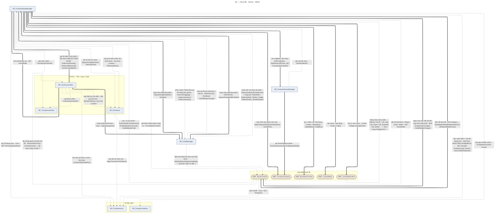

**Kiểm chứng K2:** `IM→CTX`, `IM→CTXITEM` (28/08) · `IM→BOXSEL` (24/07) · `MESHCTRL→IM` (24/07) ·
`IM→UNDO` (CaptureSnapshot), `IM→SCENE`, `SCENE→INV` (ExitReplaceMode) — **[K2 2026-09-12]**, G6.0
VERIFY (`OnLMBReleased` full flow) · `IM→INV` (`NotifyViewportSlotClick`) — **[K2 2026-09-12]**,
G6.1 as-built (hook APPEND trong `OnLMBReleased` Then 2) · `GIZMO→IM` (GET ActiveMode), `GIZMO→UNDO`
(CaptureSnapshot) — **[K2 2026-09-24]**, export `BP_GizmoController.OnMouseReleased` (nhánh "Scale" so nhầm
`NewEnumerator2` — đã sửa 25/09 — Branch 2 so `ActiveMode == Scale`, PIE PASS 3/3, xem `BP_GizmoController.md` v1.3). Còn lại: theo doc. **[24/09 v1.7]** +4 cạnh `[DOC]` rút từ 5e/5f:
`GIZMO→FA`, `MESHCTRL→IM` (SET ActiveMode), `MESHCTRL→GIZMO`, `UNDO→MESHCTRL` (2 cạnh cuối có `?`).
**[25/09 v1.8]** rút từ luồng 5j–5m: +`IM→UNDO` (các entry khác, `[DOC]`), `IM→FA`, `IM→PIVOT` (nhích), `PC→IM` (phím tắt), `CTXITEM→IM` (`?` — bind callback chưa K2), `MESHCTRL→IM` edit mode `[DOC]` · `MESHCTRL→IM` BTN_Replace **[K2 2026-07-24]** (migrate C9.0c, verify K2Node). Nhãn `IM→BOXSEL` ghi đủ `ShowBox`/`UpdateBox` (nhánh box Event Tick ✓K2 24/07); nhãn `IM→UNDO` ghi rõ `Select / Deselect`.
**[25/09 v1.11]** Bỏ `PC` (2 cạnh `PC→UNDO`, `PC→IM`): Input Action nội thất nằm trong `IM` từ Gate 1.5 B2 → cạnh phím Undo/Redo thành `IM→UNDO` (có guard `IsGizmoDragging`, PIE PASS 25/09); phím nhích / copy / dán là gọi nội bộ IM.

> **2 đường resolve click song song, KHÔNG tương đương (xác nhận K2 12/09/2026):**
> - **Đường chính** (`OnLMBReleased`, >99.9% lượt click): group-aware — qua
>   `ExpandSelectionWithGroups` → `SelectActors`/`ToggleActor`.
> - **Đường fallback** (`Event Tick`, case flick chuột cực nhanh): KHÔNG group-aware — vẫn gọi
>   `SelectSingleActor` thẳng. Đây là **bug đang sống** (`Bug-TickFallback-GroupNotExpanded`,
>   `Bugs/Open_Bugs.md`), không phải thiết kế có chủ đích.
> `FurnitureInventoryRef` truy cập qua `BP_FurnitureSceneManager` (khớp lại lần 2, độc lập, với
> phát hiện ở delta S7.G5 — không phải qua `Foff_GameInstance`).
> `SelectActors`/`SelectSingleActor` báo tin `OnSelectionChanged` ĐỒNG BỘ — mọi widget đang nghe
> (vd `MESHCTRL`, cạnh `MESHCTRL→IM` phía trên) nhận sự kiện ngay trong cùng lượt gọi, không phải
> latent/deferred — xác nhận qua K2Node export `SelectActors` (G6.0, 12/09/2026).

### 3b — Combo (lưu / spawn / thay combo)

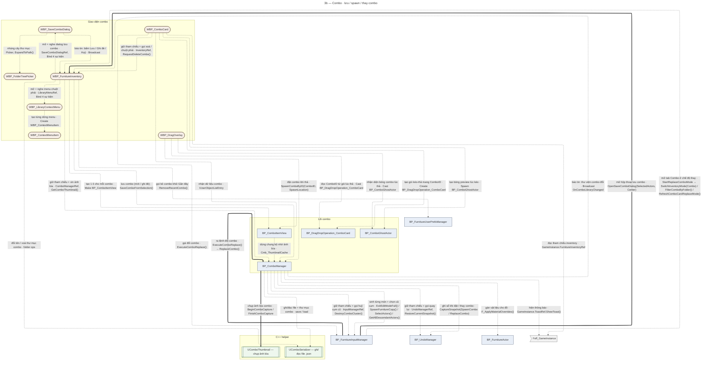

**Kiểm chứng K2:** `IM→COMBO` (02/08) · `COMBO→THUMB` (Gate F, 21/07). Còn lại: theo doc.
**[25/09 v1.8]** rút từ luồng 5q–5s: `IM→INV` OpenSaveComboDialog **[K2 2026-08-04]** (`CB_SaveCombo_Handler`) · +`[DOC]`: `IM→INV` StartReplaceComboMode, `INV→COMBO` SaveComboFromSelection, `DRAGOV→COMBO` SpawnComboByID, `COMBO→IM`, `COMBO→UNDO`.

### 3c — Inventory + Cây thư mục

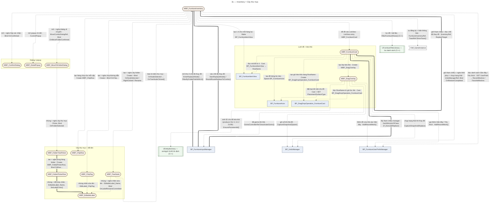

**Kiểm chứng K2:** `INV→IM` (03/08) · `FCARD→INV`, `FCARD→IM` (24/07) · `FTPICKER→FPROW` (12/07) · `FPROW→EDITLABEL` (11/07). Còn lại: theo doc. `DRAGOV→EIL` PIE-verify (21/09, ID-03 test), chưa K2 export riêng cho cạnh này.
**[25/09 v1.8]** rút từ luồng 5h, 5i, 5n: `IM→INV` EnterReplaceMode **[K2 2026-07-24]** (thân `StartReplaceMode`) · +`[DOC]`: `TREENODE→INV`, `INV→PREFS`, `DRAGOV→UNDO`, `DRAGOV→PREFS`.
**[25/09 v1.11]** Bỏ `INV→PC` (Add/Remove Mapping Context): từ Gate 1.5 B2 bộ phím do `IM` BeginPlay bật 1 lần (✓K2 25/09), nhánh `RemoveFurnitureInput` ở `BTN_Close` đã xoá 18/08.

### 3d — Save · Undo · khởi động

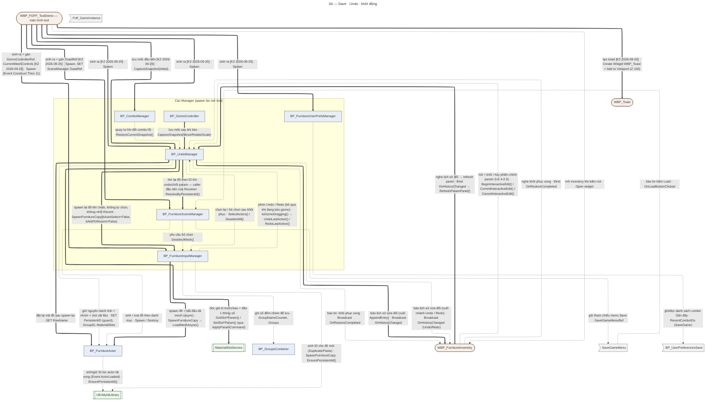

**Kiểm chứng K2:** `UNDO→FA` (mã RowName, 03/08) · `IM→EIL` (SpawnFurnitureCopy, ✓K2 export 21/09) · `SCENE` giờ có thêm hàm `ResolveByPersistentId` (✓K2 export 21/09) — đọc `FA.PersistentID` qua Tag scan. **[24/09] Đã có caller thật: `UNDO` (`ApplyParamCommand`/`Begin`/`Commit`) — sớm hơn plan (U3), QĐ6.** 5 cạnh U2.4/U2.5 mới: `[DOC]` + PIE PASS, chưa K2. Còn lại: theo doc / PIE-verify (`FA→EIL` qua ActorLoaded, `UNDO→FA` phần PersistentID — ID-02 PIE test 21/09, chưa K2 riêng). ⚠ Nguồn spawn manager: doc ghi cả `WBP_FOFF_ToolDemo` lẫn "Level BP" — chưa chốt.
**[24/09 v1.7]** nâng: `UNDO→SCENE`, `UNDO→MSS` — **[K2 2026-09-24]** (export `BeginInteractiveEdit`/`CommitInteractiveEdit`, U2.7; `ApplyParamCommand` review K2 U2.3) · `UNDO→IM SpawnFurnitureCopy(bAddToRecent=False)` — **[K2 2026-07-21]** (K3) · `IM→FA LoadMeshAsync` — **[K2 2026-09-21]** (thân `SpawnFurnitureCopy`) · `GIZMO→UNDO` — **[K2 2026-09-24]** (nhánh "Scale" đã sửa 25/09 — Branch 2 so `ActiveMode == Scale`, PIE PASS 3/3, xem `BP_GizmoController.md` v1.3). Tách `UNDO→FA`: `SET RowName` liền (03/08), `PersistentID`/`GroupID`/`MaterialSlots` đứt. Cạnh cũ `UNDO→FA "tạo lại đồ · SpawnFurnitureCopy()"` sai đích (`SpawnFurnitureCopy` là hàm của InputManager) → chuyển thành `UNDO→IM`.
**[25/09 v1.8]** rút từ luồng 5g, 5t: +`[DOC]` `TOOLDEMO→PC` (Caller Diagram trong `BP_FoffPlayerController.md`), `SGMENU→SCENE`.
**[25/09 v1.11]** Bỏ `PC` (`PC→UNDO`, `TOOLDEMO→PC`) — Input nằm trong `IM` từ Gate 1.5 B2; `IM` BeginPlay `AddMappingContext(LM_FurnitureInput)` ✓K2 25/09.
**[25/09 v1.14]** nâng `UNDO→INV` (Broadcast cuối `AppendEntry`, ✓K2 25/09) + `INV→UNDO` (Bind `OnHistoryChanged` → `Handle_HistoryChanged` → `RefreshParamPanel`, ✓K2 25/09) → **[K2 2026-09-25]**. Broadcast ở cuối nhánh Undo/Redo tách cạnh riêng, còn `[DOC]`.

### 3e — Vật liệu (Material)

```mermaid
---
title: "3e — Vật liệu (Material)"
config:
  flowchart:
    defaultRenderer: elk
---
flowchart TB
  INV(["WBP_FurnitureInventory"])
  MSS[["MaterialSlotService"]]
  FFL[["UFurnitureFilterLibrary"]]
  FA["BP_FurnitureActor"]
  COMBO["BP_ComboManager"]
  IM["BP_FurnitureInputManager"]
  UNDO["BP_UndoManager"]
  DETAIL(["WBP_DetailPopup"])
  MESHCTRL(["WBP_MeshControls"])
  MATCARD(["WBP_MaterialCard — chưa có doc"])
  DRAGOV(["WBP_DragOverlay_FurnitureCard"])
  PREFS["BP_FurnitureUserPrefsManager"]
  SCENE["BP_FurnitureSceneManager"]
  SLOT(["WBP_SlotSwatch — chưa có doc"])

  subgraph PARAMPANEL["Material Param Panel (Sprint 7 G7, 15-18/09/2026 — S7G7T1-T3.4)"]
    MINSPECT(["WBP_MaterialInspector"])
    PPANEL(["WBP_MaterialParamPanel"])
    PSROW(["WBP_ParamScalarRow"])
    PCROW(["WBP_ParamColorRow"])
    ICP(["InteriorColorPicker (C++ UWidget)"])
    UMPM[["UMaterialParamMap"]]
  end

  INV -.->|"lọc vật liệu · FilterMaterialItems() (C++)"| FFL
  INV ==>|"reset param / reset về mặc định · ResetSlotToAssetDefault() / ResetAllSlotsToAssetDefault()"| MSS
  INV ==>|"gán vật liệu vào slot (kéo-thả G5) · ApplyLoadedMaterialToSlot() → LoadAndApplyMaterial"| MSS
  INV -.->|"gán MI theo slot cho đồ · TargetFurnitureActor"| FA
  INV -.->|"đổ thẻ vật liệu vào lưới · TileView entry"| MATCARD
  INV -.->|"tạo + nghe ô màu slot · Create WBP_SlotSwatch, Bind OnSwatchClicked"| SLOT
  MESHCTRL -.->|"tạo popup chi tiết khi bấm Info · Create WBP_DetailPopup"| DETAIL
  DETAIL ==>|"vào chế độ thay đồ · StartReplaceMode()"| IM
  DETAIL -.->|"lưu mốc khi khoá / reset scale · CaptureSnapshot(Scale)"| UNDO
  DETAIL -.->|"chỉnh scale đồ đang chọn · SelectedFurnitureActor"| FA
  COMBO -.->|"gán vật liệu khi spawn combo · F_ApplyMaterialOverrides()"| FA

  MINSPECT -.->|"forward 5 hàm xuống panel con · SetHeader/ClearParamRows/AddParamRow/ShowParamEmptyState/SetResetEnabled → ParamPanelRef"| PPANEL
  PCROW -.->|"nhúng picker, gọi SetColor/GetColor + nghe 3 dispatcher · InteriorColorPicker (UInteriorColorPickerWidget)"| ICP
  PCROW -.->|"parse hex khi commit ô Hex · HexToLinearColor()"| UMPM

  INV ==>|"tra từ điển param theo material · GetControlsForMaterial(SlotMaterial, DT_ParamMap)"| UMPM
  INV ==>|"build/xóa danh sách row + empty-state · ClearParamRows()/AddParamRow()/ShowParamEmptyState(), SetVisibility"| MINSPECT
  INV ==>|"tạo row Scalar · Create WBP_ParamScalarRow → Setup()"| PSROW
  INV ==>|"tạo row Color · Create WBP_ParamColorRow → Setup()"| PCROW
  INV -.->|"seed giá trị row = giá trị THẬT trên MID/MI (U2.5, thay Cast MID+fallback) · GetSlotScalarParam() / GetSlotVectorParam()"| MSS
  PSROW ==>|"báo đang kéo · OnPreviewChanged(ParamName, Value)"| INV
  PSROW -.->|"báo bắt đầu / thả · OnEditBegin(ParamName) → Handle_ScalarBegin, OnEditCommitted"| INV
  PCROW ==>|"báo đang chỉnh · OnPreviewChanged(ParamName, Value)"| INV
  PCROW -.->|"báo bắt đầu / thả · OnEditBegin(ParamName) → Handle_ColorBegin, OnEditCommitted"| INV
  INV -.->|"mở/chốt/hủy phiên chỉnh (chi tiết ở 3d) · Begin/Commit/CancelInteractiveEdit()"| UNDO
  FA -.->|"đồng bộ slot chọn + highlight + refresh panel sau kéo-thả · SET SelectedSlotIndex/Name, HighlightSwatchByIndex(), RefreshParamPanel()"| INV
  FA -.->|"gắn lại vật liệu + thông số từng slot sau khi tải mesh (Undo) · ApplyLoadedMaterialToSlot() → ApplyParamsJsonToSlot()"| MSS
  MATCARD -.->|"bấm thẻ → áp cho món đang mở panel · ApplyMaterial(RowName)"| INV
  MATCARD -.->|"kéo thẻ → phủ lớp kéo-thả mang RowName · Create WBP_DragOverlay + BP_DragDropOperation_Material"| DRAGOV
  INV ==>|"thêm vật liệu vào Gần đây · AddRecentMaterial()"| PREFS
  DRAGOV ==>|"tìm món + slot dưới điểm thả · TraceSlotUnderCursor()"| MSS
  DRAGOV ==>|"giao việc đổi vật liệu cho món bị thả trúng · ApplyMaterialByRowName()"| FA
  DRAGOV ==>|"báo thả trúng kiến trúc · ToastRef.ShowToast()"| SCENE
  FA -.->|"ghi sổ sau khi đổi vật liệu · CaptureSnapshot(ApplyMaterial)"| UNDO
  FA -.->|"thêm vật liệu vào Gần đây · AddRecentMaterial()"| PREFS

  classDef bp fill:#e8eef7,stroke:#33415c;
  classDef wbp fill:#f7efe8,stroke:#5c4633;
  classDef svc fill:#eef7ee,stroke:#356335;
  class FA,COMBO,IM,UNDO,PREFS,SCENE bp;
  class INV,DRAGOV,DETAIL,MESHCTRL,MATCARD,SLOT,MINSPECT,PPANEL,PSROW,PCROW,ICP wbp;
  class MSS,FFL,UMPM svc;
```

**Kiểm chứng K2:** `DETAIL→IM` (24/07) · `INV→MSS` (`LoadAndApplyMaterial`/`ApplyLoadedMaterialToSlot`,
K2Node export thật, S7.G2 Việc 2+3, 05/09) — **[K2 2026-09-05]** · `INV→UMPM`, `INV→MINSPECT`,
`INV→PSROW`, `INV→PCROW` (toàn bộ `RefreshParamPanel()`, K2Node export thật, S7G7T3.3, 18/09) —
**[K2 2026-09-18]**. Còn lại (`FA→INV`, `MINSPECT→PPANEL`, `PCROW→ICP`, `PCROW→UMPM`): theo doc
(as-built + test PASS, KHÔNG phải raw K2 dump — giữ nét đứt theo quy ước strict của map).
**[24/09 v1.7]** tách `PSROW→INV` / `PCROW→INV`: phần `OnPreviewChanged` nâng **[K2 2026-09-15]** (event flow export thật
khi tạo row, S7G7T2 — `Slider_Value.OnValueChanged` / `OnColorChanged`); `OnEditBegin`/`OnEditCommitted` giữ đứt (test PASS,
không có export riêng). +`FA→MSS` `[DOC]` (rút từ 5e, `BP_FurnitureActor` Rst_LoadNextSlot).
**[25/09 v1.8]** rút từ luồng 5o, 5p: **[K2 2026-09-11]** `DRAGOV→MSS` (TraceSlotUnderCursor), `DRAGOV→FA` (ApplyMaterialByRowName), `DRAGOV→SCENE` (Toast) — nhánh Material `On Drop` · **[K2 2026-09-05]** `INV→PREFS` (AddRecentMaterial, thân `LoadAndApplyMaterial`) · +`[DOC]` `MATCARD→INV`, `MATCARD→DRAGOV`, `FA→UNDO`, `FA→PREFS`.

> **[SUPERSEDED — T4 18/09 + U2.5 24/09]** Ghi chú dưới là trạng thái 17/09: 4 handler nay đã có thân (T4) và
> nối session undo (U2.5) — cạnh `INV→MSS`/`INV→UNDO` đã vẽ. Giữ đoạn cũ làm lịch sử.
> **4 delegate handler RỖNG (T4, chưa build thân):** `RefreshParamPanel` bind
> `Handle_ScalarPreview`/`Handle_ScalarCommit`/2 handler Color vào dispatcher của `PSROW`/`PCROW`,
> nhưng thân 4 handler này RỖNG — chưa nối `PSROW`/`PCROW` → `MSS` (SetSlotParam) như plan T4. KHÔNG
> vẽ cạnh `PSROW→MSS`/`PCROW→MSS` cho tới khi T4 build xong (xem `01_Session_State.md`).
> `WBP_MaterialParamPanel.AddRow(Row:UserWidget)` nhận tham số generic — KHÔNG tạo cạnh
> type-specific `PPANEL→PSROW`/`PPANEL→PCROW` (việc gọi `AddRow` với instance cụ thể là
> `MaterialInspectorRef.AddParamRow` forward xuống, nội bộ `WBP_MaterialInspector`).

---

## Phần 4 — Index map

| Blueprint/Widget | Chức năng chính (1 dòng) | Canonical doc chi tiết | Trạng thái verify |
|---|---|---|---|
| `BP_FurnitureInputManager` | Core hub — input/multi-select/box-select/context-menu/group/edit-mode | `Blueprints/BP_FurnitureInputManager.md` | `[chưa rà L-DOC]` |
| `BP_UndoManager` | Undo/Redo stack — S_SceneSnapshot V4 + EditModeStack | `Blueprints/BP_UndoManager.md` | `[chưa rà L-DOC]` |
| `BP_ComboManager` | Combo logic — save/spawn/replace (Sprint 5) | `Blueprints/BP_ComboManager.md` | `[chưa rà L-DOC]` |
| `BP_FurnitureSceneManager` | EMS Save/Load; spawn/destroy furniture actor | `Blueprints/BP_FurnitureSceneManager.md` | `[chưa rà L-DOC]` |
| `BP_FurnitureUserPrefsManager` | UserPrefs Favorite/Recent combo — EMS SaveGame | `Blueprints/BP_FurnitureUserPrefsManager.md` | `[chưa rà L-DOC]` |
| `BP_GizmoController` | Gizmo movement — TransformMode, axis drag, ray-plane, snap | `Blueprints/BP_GizmoController.md` | `[chưa rà L-DOC]` |
| `BP_PivotActor` | Pivot vô hình cho multi-gizmo move/rotate/scale | `Blueprints/BP_PivotActor.md` | `[chưa rà L-DOC]` |
| `BP_FurnitureActor` | Từng đồ nội thất trong scene — SaveGame vars | `Blueprints/BP_FurnitureActor.md` | `[chưa rà L-DOC]` |
| `BP_ComboGhostActor` | Ghost preview bounding-box combo lúc drag | `Blueprints/BP_ComboGhostActor.md` | `[chưa rà L-DOC]` |
| `BP_ComboItemView` | Bọc FComboData thành UObject cho CTV_ComboCard | `Blueprints/BP_ComboItemView.md` | `[chưa rà L-DOC]` |
| `BP_FoffPlayerController` | Mapping Context + bind Enhanced Input Undo/Redo | `Blueprints/BP_FoffPlayerController.md` | `[chưa rà L-DOC]` |
| `WBP_FurnitureInventory` | Inventory chính — filter/search/folder/pagination/material/resize/replace | `Widgets/WBP_FurnitureInventory.md` | `[chưa rà L-DOC]` |
| `WBP_MeshControls` | Persistent toolbar — Move/Rotate/Scale/Delete, info bar | `Widgets/WBP_MeshControls.md` | `[chưa rà L-DOC]` |
| `WBP_ResizeWindow` | Resize 8 hướng cho WBP_FurnitureInventory | `Widgets/WBP_ResizeWindow.md` | `[chưa rà L-DOC]` |
| `WBP_BoxSelectOverlay` | Khung rubber-band box-select (display-only) | `Widgets/WBP_BoxSelectOverlay.md` | `[chưa rà L-DOC]` |
| `WBP_DetailPopup` | Popup thông tin sản phẩm + Scale editor | `Widgets/WBP_DetailPopup.md` | `[chưa rà L-DOC]` |
| `WBP_FurnitureCard` | Card 1 mặt hàng nội thất — IUserObjectListEntry | `Widgets/WBP_FurnitureCard.md` | `[chưa rà L-DOC]` |
| `WBP_ComboCard` | Card 1 combo trong tab Combo — IUserObjectListEntry | `Widgets/WBP_ComboCard.md` | `[chưa rà L-DOC]` |
| `WBP_DragOverlay` | Overlay drag & drop khi kéo furniture card | `Widgets/WBP_DragOverlay_FurnitureCard.md` | `[chưa rà L-DOC]` |
| `WBP_TreeNode` | Node 1 cấp folder trong cây WBP_FurnitureInventory | `Widgets/WBP_TreeNode.md` | `[chưa rà L-DOC]` |
| `WBP_ChipTag` | Chip 1 folder con trong breadcrumb | `Widgets/WBP_ChipTag.md` | `[chưa rà L-DOC]` |
| `WBP_EditableLabel` | Component inline-rename tái dùng | `Widgets/WBP_EditableLabel.md` | `[chưa rà L-DOC]` |
| `WBP_FolderTreePicker` | Lớp-2 shared tree picker (Move/Save dialog) | `Widgets/WBP_FolderTreePicker.md` | `[chưa rà L-DOC]` |
| `WBP_FolderPickerRow` | Row của WBP_FolderTreePicker (C5.8) | `Widgets/WBP_FolderPickerRow.md` | `[chưa rà L-DOC]` |
| `WBP_LibraryContextMenu` | Context menu Combo Library — clone WBP_ContextMenu | `Widgets/WBP_LibraryContextMenu.md` | `[chưa rà L-DOC]` |
| `WBP_ConfirmDialog` | Dialog Yes/No generic | `Widgets/WBP_ConfirmDialog.md` | `[chưa rà L-DOC]` |
| `WBP_SaveComboDialog` | Dialog nhập tên/folder/tags khi lưu combo + Save As/Đè | `Widgets/WBP_SaveComboDialog.md` | `[chưa rà L-DOC]` |
| `WBP_MoveToFolderDialog` | Dialog modal chọn folder đích khi move folder | `Widgets/WBP_MoveToFolderDialog.md` | `[chưa rà L-DOC]` |
| `WBP_MoveFolderRow` | **[SUPERSEDED]** bởi WBP_FolderPickerRow | `Widgets/WBP_MoveFolderRow.md` | `[chưa rà L-DOC]` |
| `WBP_Toast` | Toast global — Foff_GameInstance.ToastRef | `Widgets/WBP_Toast.md` | `[chưa rà L-DOC]` |
| `InteriorColorPicker` | C++ UWidget — color picker wheel H/S + slider V (Sprint 7 G7.0a) | `Widgets/InteriorColorPicker.md` | `[chưa rà L-DOC]` |
| `WBP_ParamScalarRow` | Row Scalar param — Slider+SpinBox (Sprint 7 S7G7T2) | `Widgets/WBP_ParamScalarRow.md` | `[chưa rà L-DOC]` |
| `WBP_ParamColorRow` | Row Color param — nhúng InteriorColorPicker + Hex (Sprint 7 S7G7T2) | `Widgets/WBP_ParamColorRow.md` | `[chưa rà L-DOC]` |
| `WBP_MaterialParamPanel` | Panel build danh sách row param (Sprint 7 S7G7T3.1) | `Widgets/WBP_MaterialParamPanel.md` | `[chưa rà L-DOC]` |
| `WBP_MaterialInspector` | Panel phải — header+panel+footer (Sprint 7 S7G7T3.2) | `Widgets/WBP_MaterialInspector.md` | `[chưa rà L-DOC]` |
| `UComboSerializer` | C++ — combo save/load JSON + folder ops | `Data/ComboSerializer_Reference.md` | `[chưa rà L-DOC]` |
| `UComboThumbnail` | C++ — capture/load thumbnail PNG (SSAA + temporal accum) | `Data/ComboSerializer_Reference.md` | `[chưa rà L-DOC]` |
| `UFurnitureFilterLibrary` | C++ — FilterFurnitureRows / FilterMaterialItems / GetDistinctFolderPaths | `Data/FurnitureFilterLibrary_Reference.md` | `[chưa rà L-DOC]` |
| `MaterialSlotService` | C++ — slot-by-name API (Sprint 7 G1) | `Data/MaterialSlotService_Reference.md` | `[chưa rà L-DOC]` |
| `UMaterialParamMap` | C++ — từ điển param, GetControlsForMaterial/HexToLinearColor (Sprint 7 S7G7T1/T2) | `Data/MaterialSlotService_Reference.md` | `[chưa rà L-DOC]` |
| `UEntityIdLibrary` | C++ — GUID-string ổn định cho actor (EnsurePersistentId/IsValidPersistentId), nền Undo Architecture U1 | `Data/EntityIdLibrary_Reference.md` | `[K2 2026-09-21]` (SpawnFurnitureCopy, ResolveByPersistentId) |

---

## Phần 5 — Luồng runtime (sequenceDiagram, mức event/function)

> Thêm 24/09/2026 (v1.4) theo skill `arch-map` §5 ("Runtime communication → `sequenceDiagram`"). Mỗi sơ đồ = 1 THAO TÁC
> của user, đọc từ trên xuống theo thời gian. Mức asset (ai nói chuyện với ai) vẫn ở Phần 3.
>
> **Quy ước (diagram-contract §2 áp cho sequence):** mũi tên **liền** `->>` = quan hệ đã **✓K2** · mũi tên **đứt** `-->>` =
> **theo doc** (as-built + PIE, chưa K2). Mũi tên xuất phát từ `User` = thao tác người dùng, không mang trạng thái bằng chứng.
> Nhãn song ngữ: *câu tiếng Việt · tên hàm thật*. Mỗi sơ đồ kết bằng dòng `Kiểm chứng K2:`.
> Render PASS bằng mermaid-cli 24/09 (MCP `claude-mermaid` không có trong phiên cloud — xem lại bằng `mermaid_preview` khi chạy `/arch-map`).
>
> **Đọc theo hành trình người dùng (25/09, v1.8):** mỗi mục 5x thuộc 1 note luồng ở `Brain/Luồng/` (L01 Mở tool → L13 Undo). Thứ tự mục ở đây là thứ tự viết, không phải thứ tự đọc — người mới bắt đầu ở [[Bản đồ não]].

### 5a — Click chọn đồ trong viewport

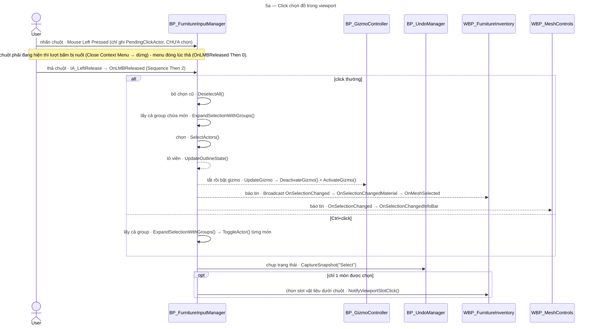
**Kiểm chứng K2:** toàn bộ thân `OnLMBReleased` (DeselectAll / ExpandSelectionWithGroups / SelectActors / ToggleActor / CaptureSnapshot / NotifyViewportSlotClick) — 2026-09-12 (G6.0). Còn lại theo doc: bên trong `SelectActors` (UpdateOutlineState, UpdateGizmo, Broadcast), `UpdateGizmo` nhánh 1 món có `DeactivateGizmo` trước (fix B-gizmo 24/09, PIE PASS, chưa K2), phía nghe `OnSelectionChanged`.
Nguồn: `Blueprints/BP_FurnitureInputManager.md` (OnLMBReleased FULL FLOW, SelectActors, UpdateGizmo) · `BP_GizmoController.md` · `Widgets/WBP_FurnitureInventory.md` (OnSelectionChangedMaterial, OnMeshSelected, NotifyViewportSlotClick).

### 5b — Chỉnh 1 thông số vật liệu (U2 Interactive Edit Session)

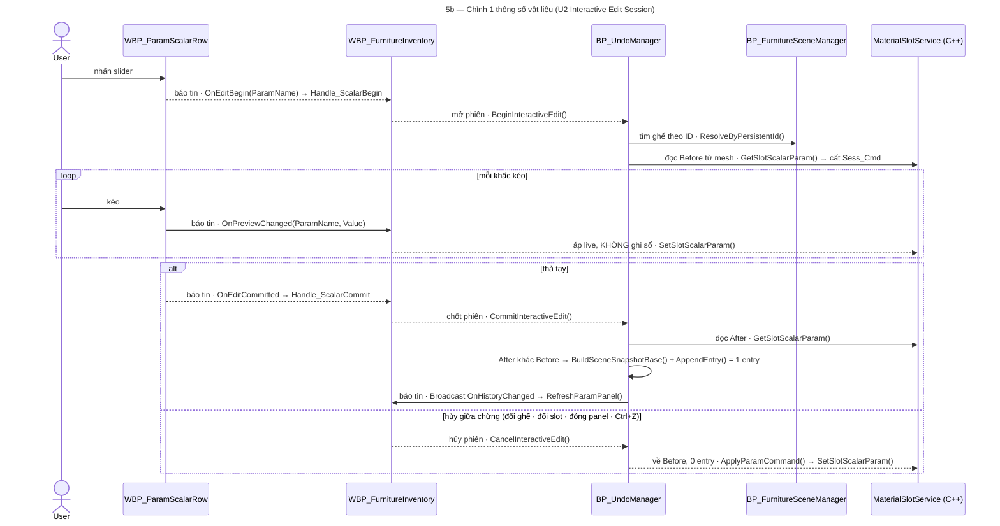
**Kiểm chứng K2:** thân `BeginInteractiveEdit` + `CommitInteractiveEdit` (Resolve / GetSlot…Param / Build+Append) — 2026-09-24 · `ROW→INV OnPreviewChanged` (`Slider_Value.OnValueChanged`, T2/T4) · `ResolveByPersistentId` (2026-09-21). Còn lại theo doc (PIE PASS U2.4/U2.5): 2 handler Begin/Commit + Preview bên Inventory, `OnEditBegin`/`OnEditCommitted` phía row, `CancelInteractiveEdit`, ~~broadcast `OnHistoryChanged` từ AppendEntry~~ (✓K2 25/09: `AppendEntry` + Inventory bind). Row màu (`WBP_ParamColorRow`) đối xứng, thay `GetSlotVectorParam`/`SetSlotVectorParam`.
Nguồn: `Blueprints/BP_UndoManager.md` v1.22 · `Widgets/WBP_FurnitureInventory.md` v3.33 · `WBP_ParamScalarRow.md` v1.2 · `Data/MaterialSlotService_Reference.md`.

### 5c — Undo / Redo — tổng quan (dispatch theo EntryKind)

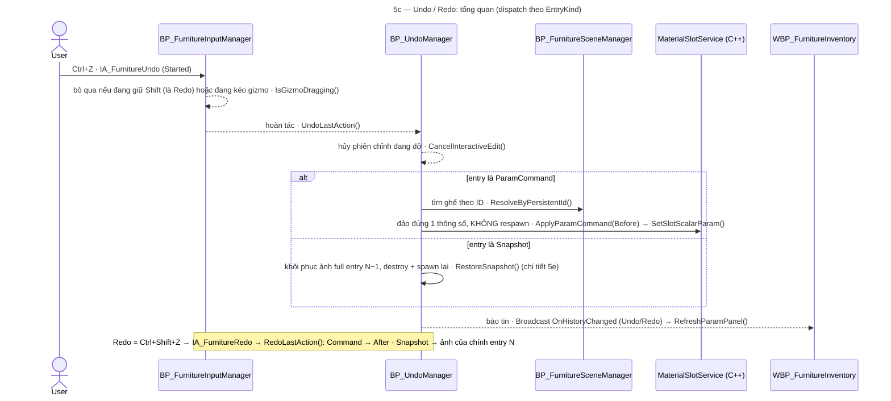
**Kiểm chứng K2:** dispatch `EntryKind` trong Undo/Redo + thân `ApplyParamCommand` — review K2 U2.3 (2026-09-24) · `ResolveByPersistentId` (2026-09-21). Còn lại theo doc: phím → `UndoLastAction` nằm trong `BP_FurnitureInputManager` (Gate 1.5 B2, cuhoang 25/09; check Shift theo doc cũ + guard `IsGizmoDragging` PIE PASS 25/09 — chưa K2 event), `CancelInteractiveEdit()` node đầu + broadcast cuối nhánh Undo/Redo (U2.4–U2.6, PIE PASS, chưa K2 — phía Inventory nghe đã ✓K2 25/09).
Nguồn: `Blueprints/BP_UndoManager.md` v1.22 · `BP_FurnitureInputManager.md` v3.10 (Enhanced Input Actions).

### 5d — Ghi sổ lịch sử — 1 thao tác thành 1 entry (CaptureSnapshot)

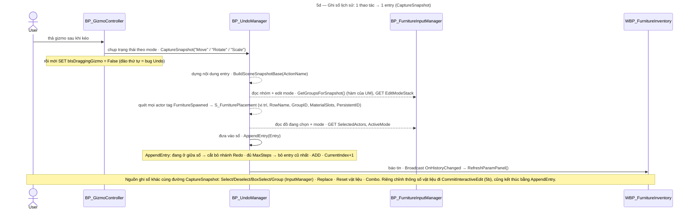
**Kiểm chứng K2:** ngoài `GZ→UM`, không cạnh nào trong sơ đồ này là K2 trọn vẹn — `BuildSceneSnapshotBase` mới soi K2 ~40% đầu (U2.3), `AppendEntry` ✓K2 2026-09-25 (thân khớp doc: cắt Redo → bỏ cũ nhất → ADD → +1 → Broadcast); `CaptureSnapshot` 2-node theo doc + PIE (W7, REG-01..05). `UM→INV` Broadcast → `Handle_HistoryChanged` → `RefreshParamPanel` ✓K2 2026-09-25 (bind ở Inventory Event Construct Then 6). Nguồn ghi sổ `IM→UM CaptureSnapshot("Select")` là K2 (2026-09-12, xem 5a). `GZ→UM` ✓K2 2026-09-24 (export `OnMouseReleased` — nhánh "Scale" so nhầm `NewEnumerator2`, đã sửa 25/09 — Branch 2 so `ActiveMode == Scale`, PIE PASS 3/3, xem `BP_GizmoController.md` v1.3).
Nguồn: `Blueprints/BP_UndoManager.md` v1.22 (BuildSceneSnapshotBase, AppendEntry, CaptureSnapshot) · `BP_GizmoController.md`.

### 5e — Undo 1 entry Snapshot — RestoreSnapshot (destroy + spawn lại)

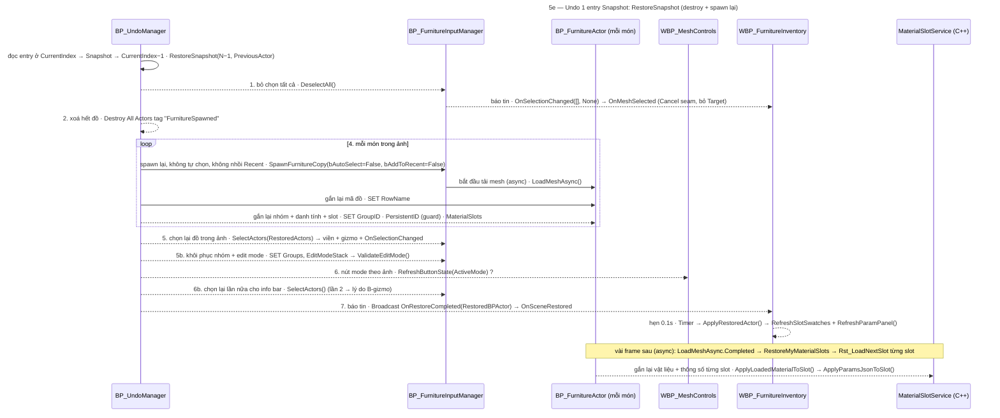
**Kiểm chứng K2:** `UM→IM SpawnFurnitureCopy(... bAddToRecent=False)` (K3, 2026-07-21) · `UM→FA SET RowName` (2026-08-03) · `IM→FA LoadMeshAsync` (thân SpawnFurnitureCopy, 2026-09-21) · dispatch vào `RestoreSnapshot` (U2.3). Còn lại theo doc — thân `RestoreSnapshot` Step 1/2/5/5b/6/6b/7 chưa soi K2 riêng (D-3).
**CONFLICT (24/09 v1.7):** bản trước vẽ `SET RowName · GroupID · PersistentID · MaterialSlots` chung 1 mũi tên liền và ghi `SET PersistentID` guard ✓K2 (U1 21/09), nhưng sơ đồ 3d ghi phần PersistentID "ID-02 PIE, chưa K2 riêng" → tách: `SET RowName` liền, phần còn lại đứt (diagram-contract §6 — giữ state thấp hơn) tới khi có K2 Step 4.
**?** `RefreshButtonState` là hàm của `WBP_MeshControls`; doc `BP_UndoManager` Step 6 gọi nó nhưng KHÔNG ghi UndoManager lấy tham chiếu MeshControls từ đâu → giữ `?` tới khi có K2.
**⚠ Doc gap:** changelog `BP_UndoManager` v1.17 nói Step 4 "chỉ còn `SET MaterialSlots`", nhưng code block Step 4 hiện KHÔNG có dòng `SET NewActor.MaterialSlots` — sơ đồ vẽ theo changelog; cần K2 Step 4 để chốt.
**3 nhịp thời gian sau Undo:** (1) ngay trong frame: spawn + chọn lại + gizmo · (2) +0.1s: Inventory refresh (`ApplyRestoredActor`) · (3) vài frame sau: vật liệu + thông số từng slot (async). Quan sát sớm hơn nhịp (3) sẽ thấy vật liệu "chưa đúng" — chưa phải lỗi (bài học U2.3, `Learning_System.md`).
Nguồn: `Blueprints/BP_UndoManager.md` (RestoreSnapshot v1.10+) · `BP_FurnitureInputManager.md` (SpawnFurnitureCopy ✓K2) · `BP_FurnitureActor.md` (LoadMeshAsync, RestoreMyMaterialSlots, Rst_LoadNextSlot) · `Widgets/WBP_FurnitureInventory.md` (OnSceneRestored, ApplyRestoredActor).

### 5f — Kéo gizmo Move (1 món · nhiều món qua Pivot)

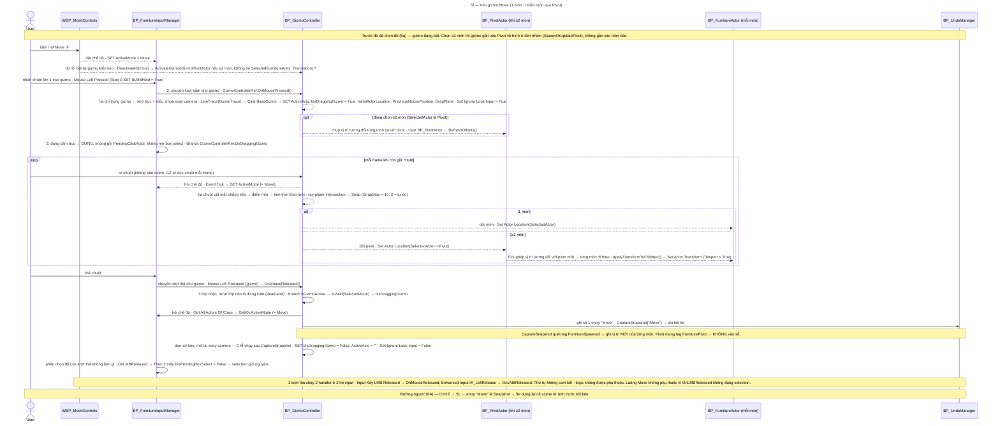
**Kiểm chứng K2:** thân `BP_GizmoController.OnMouseReleased` ✓K2 2026-09-24 (3 lớp chặn · GET ActiveMode · CaptureSnapshot · dọn cờ). IM Input Key LMB Pressed (Step 0–7) + Released — 2026-09-25 → bước bấm/thả và "selection giữ nguyên" nét liền. Còn lại theo doc.
**?** (1) `WBP_MeshControls` gọi `DeactivateGizmo`/`ActivateGizmo` nhưng doc không ghi lấy tham chiếu `BP_GizmoController` từ đâu. (2) ~~Step 3 đọc biến nào~~ — ✓K2 25/09: `GizmoControllerRef.bIsDraggingGizmo`. (3) ~~Thứ tự 2 handler lúc thả chuột~~ — đóng 25/09: `OnLMBReleased` do `IA_LeftRelease` (Enhanced Input) gọi, gizmo do Input Key LMB Released gọi; 2 hệ khác nhau, thứ tự không cam kết, hiện không có phụ thuộc.
**⚠ Từ K2 24/09:** (1) ~~dọn cờ chỉ chạy sau CaptureSnapshot → kẹt `bIsDraggingGizmo` + Ignore Look Input khi Ctrl+Z lúc đang kéo~~ — đã sửa 25/09 (lớp chặn 1–2 → Branch mới `bIsDraggingGizmo` → dọn cờ, không ghi sổ), PIE PASS. Mốc "Move" thừa khi Undo về mốc có selection — đã chặn ở cửa vào: IA Undo/Redo bỏ qua khi đang kéo (`IsGizmoDragging`), PIE PASS 25/09. (2) ~~2 Branch chọn tên entry cùng so `ActiveMode == NewEnumerator2` → nhánh "Scale" không bao giờ chạy~~ — đã sửa 25/09 — Branch 2 so `ActiveMode == Scale`, PIE PASS 3/3. Chi tiết `BP_GizmoController.md` v1.3.
**K2 cần để nâng nét liền (ưu tiên):** ① ~~`OnMouseReleased`~~ xong 24/09 · ② ~~IM Mouse Left Pressed + Released~~ xong 25/09 · ③ `BP_GizmoController` Event Tick nhánh Move (Then 1) · ④ `WBP_MeshControls` BTN_Move OnClicked.
**Lệch Phần 3a:** đã bổ sung ở v1.7 (`MESHCTRL→IM`, `MESHCTRL→GIZMO`, `GIZMO→FA`).
Nguồn: `Blueprints/BP_GizmoController.md` v1.1 (ActivateGizmo, DeactivateGizmo, OnMousePressed, OnMouseReleased, Event Tick — Movement) · `BP_FurnitureInputManager.md` v3.9 (Mouse Left Pressed v1.5, Mouse Left Released (gizmo) v1.4, OnLMBReleased ✓K2, SpawnOrUpdatePivot, UpdateGizmo) · `BP_PivotActor.md` v1.1 (RefreshOffsets, ApplyTransformToChildren, tag FurniturePivot) · `Widgets/WBP_MeshControls.md` v1.8 (Pattern BTN_Move).


### 5g — Mở tool và mở kho đồ

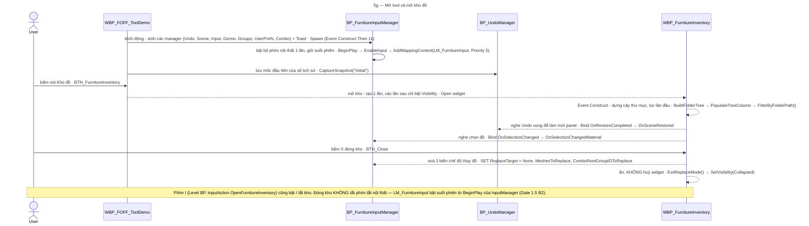
**Kiểm chứng K2:** `IM` Event BeginPlay (`EnableInput` → `AddMappingContext(LM_FurnitureInput, P5)`) — 2026-09-25. Còn lại theo doc.
**[25/09 v1.11] Sửa drift:** bản v1.8 vẽ `AddFurnitureInput` / `RemoveFurnitureInput` qua `BP_FoffPlayerController` theo doc cũ — sai từ Gate 1.5 B2 (18/08), đã bỏ.
**Kiểm chứng K2 (tiếp):** `WBP_FOFF_ToolDemo` Event Construct Then 11 (spawn + `CaptureSnapshot("Initial")`) — 2026-09-25. CONFLICT Level BP đã đóng: widget sinh, IM sinh TRƯỚC Gizmo.
**?** `ToastRef` trong chuỗi khởi động gán vào `BP_FurnitureSceneManager`; các chỗ ghi `Foff_GameInstance.ToastRef` (bảng Phần 1, cạnh `COMBO→GI`, `INV→GI`) chưa có K2 — có thể là đường cũ.
**?** `WBP_FOFF_ToolDemo` chưa có doc canonical — mũi tên mở kho rút từ 3d.
Nguồn: `Blueprints/BP_FurnitureInputManager.md` v3.10 (Event BeginPlay ✓K2) · `Widgets/WBP_FurnitureInventory.md` (Event Construct, BTN_Close, Level Blueprint) · `BP_FurnitureInputManager.md` (Level Blueprint — Spawn Order) · Phần 3d.

### 5h — Tìm đồ trong kho (gõ tìm · thư mục · Gần đây · Yêu thích)

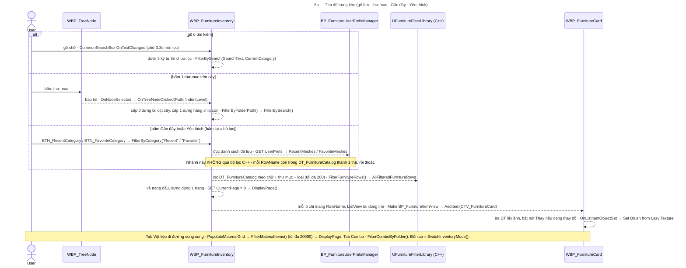
**Kiểm chứng K2:** chưa có — toàn bộ theo doc (`OnTreeNodeClicked` là bản dịch node thật nhưng doc không ghi ngày K2).
Nguồn: `Data/FilterBySearch_Logic.md` v1.3 · `Data/FilterByCategory_Logic.md` · `Widgets/WBP_FurnitureInventory.md` (SwitchInventoryMode, DisplayPage, OnTreeNodeClicked, Pagination) · `Widgets/WBP_FurnitureCard.md` (OnListItemObjectSet) · `Data/FurnitureFilterLibrary_Reference.md`.

### 5i — Kéo đồ từ kho thả vào phòng

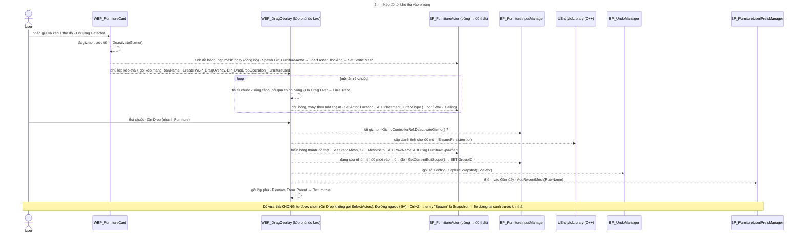
**Kiểm chứng K2:** doc `On Drop` ghi "As-built thật (K2Node export, đối chiếu 11/09/2026)" nhưng chỉ nhánh Material có dòng chốt + test riêng; nhánh Furniture chèn thêm `EnsurePersistentId` ngày 21/09 (sau K2) → giữ nét đứt cả luồng.
**CONFLICT:** cùng doc ghi G5.4 "`FunctionEntry.then` nối thẳng vào `Cast To BP_DragDropOperation_FurnitureCard`", nhưng khối exec lại vẽ `DeactivateGizmo` đứng trước Cast → mũi tên `DO→IM DeactivateGizmo` giữ `?`.
**?** Thả hụt (tia không trúng) — nhánh `Branch(Hit)` False là dead-end; doc không ghi overlay + đồ bóng được dọn ở đâu (có thể là `On Drag Cancelled` của thẻ).
Nguồn: `Widgets/WBP_FurnitureCard.md` (On Drag Detected, On Drag Cancelled) · `Widgets/WBP_DragOverlay_FurnitureCard.md` v1.10 (On Drag Over, On Drop) · `Data/EntityIdLibrary_Reference.md`.

### 5j — Quét chọn nhiều món (box select)

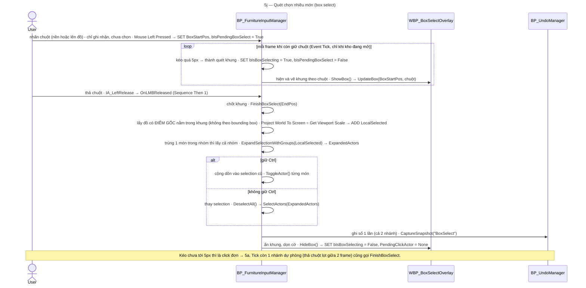
**Kiểm chứng K2:** nhánh box của Event Tick (`SET bIsBoxSelecting`, `ShowBox`, `UpdateBox`) — 2026-07-24 (C9.0c) · `OnLMBReleased` Then 1 (gọi `FinishBoxSelect`, `HideBox`) — 2026-09-12 (G6.0). Thân `FinishBoxSelect` — 2026-09-25 (CONFLICT cũ đã đóng: có `ExpandSelectionWithGroups`; khung rỗng thì không ghi sổ).
Bug-BoxSelectCtrl-MultiSnapshot (nhánh Ctrl ghi N mốc) đã fix 25/09, PIE PASS.
Nguồn: `Blueprints/BP_FurnitureInputManager.md` (TƯƠNG TÁC 3 ĐIỂM, Mouse Left Pressed, Event Tick — Box Select branch ✓K2 24/07, OnLMBReleased ✓K2 12/09, FinishBoxSelect) · `Widgets/WBP_BoxSelectOverlay.md`.

### 5k — Nhích đồ bằng phím mũi tên (Nudge)

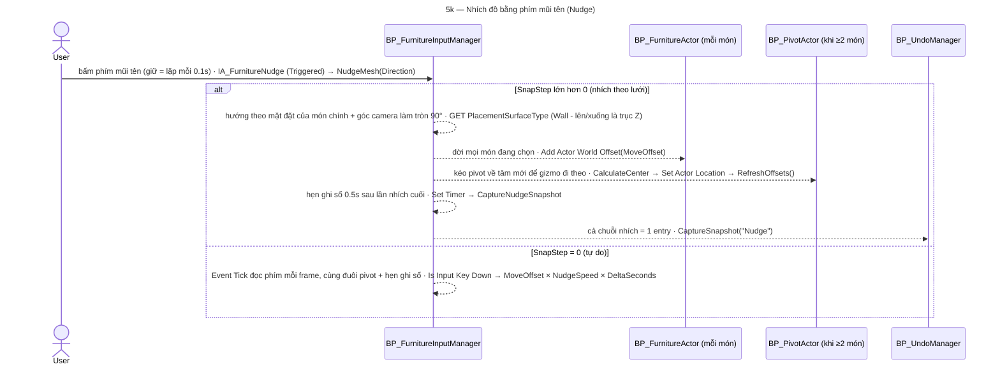
**Kiểm chứng K2:** chưa có — toàn bộ theo doc (`Nudge_Flow.md` v1.2). Event `IA_FurnitureNudge` nằm trong InputManager từ Gate 1.5 B2 (mục "Routing" của `Nudge_Flow.md` lỗi thời).
Nguồn: `Blueprints/Flows/Nudge_Flow.md` v1.2 (IA_FurnitureNudge, NudgeMesh, CaptureNudgeSnapshot, Event Tick free mode) · `BP_FurnitureInputManager.md` (B1 — Arrow Key Nudge).

### 5l — Nhóm đồ và vào / ra sửa nhóm

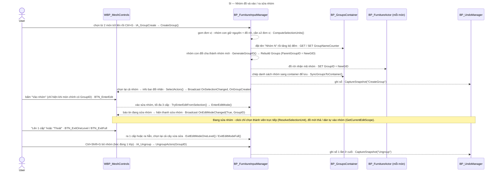
**Kiểm chứng K2:** chưa có — toàn bộ theo doc (CreateGroup v1.9, UngroupActors v1.8, Edit Mode v1.7).
**Đã đóng `?` (25/09, Find in Blueprints — cuhoang):** 2 event `IA_GroupCreate` và `IA_Ungroup` nằm trong `BP_FurnitureInputManager` (tên thật `IA_Ungroup`, `Data_Structures.md` ghi `IA_GroupUngroup` — lệch tên). Thân event chưa K2. Vào / ra sửa nhóm không ghi sổ Undo riêng — `EditModeStack` đi kèm mọi snapshot.
Nguồn: `Blueprints/BP_FurnitureInputManager.md` (CreateGroup, UngroupActors, SyncGroupsToContainer, EDIT MODE FUNCTIONS, ResolveSelectionUnit) · `Blueprint_Logic_NodeFlow.md` (OnClicked BTN_EnterEdit / ExitOneLevel / ExitFull, caller Ctrl+Shift+G) · `Widgets/WBP_MeshControls.md`.

### 5m — Menu chuột phải và phím tắt (copy · dán · nhân bản · xoá)

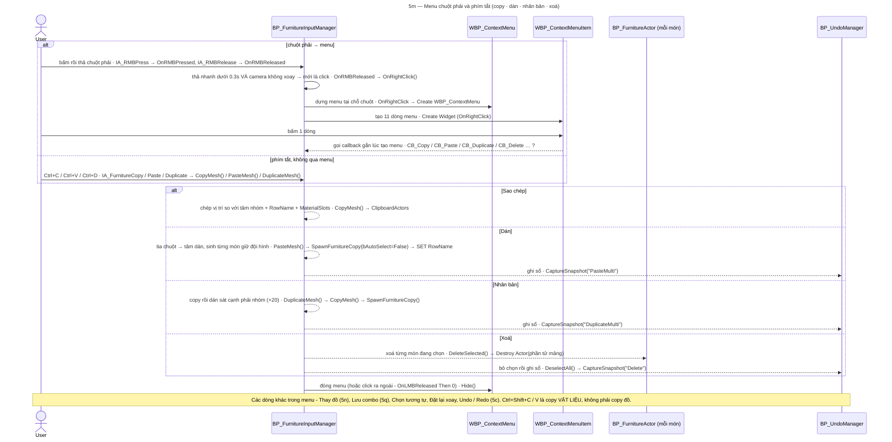
**Kiểm chứng K2:** `OnRMBPressed` / `OnRMBReleased` → `OnRightClick` — 2026-08-24 · `IM→CTX`, `IM→CTXITEM` (tạo menu + 11 dòng, gọi `Hide`) — 2026-08-28 (Phần 3a) · đóng menu ở `OnLMBReleased` Then 0 — 2026-09-12. Còn lại theo doc — thân `OnRightClick` (bind callback) doc tự ghi "⚠ suy luận, chưa verify"; `SpawnFurnitureCopy` bên trong Paste / Duplicate là ✓K2 (2026-09-15, 2026-09-21) nhưng thân PasteMesh / DuplicateMesh thì chưa.
**?** Cách mỗi dòng menu gọi tới `CB_*` (bind trong `OnRightClick`) chưa có K2. Phím Delete: danh sách phím tắt ghi "Delete = xoá" nhưng không ghi handler.
Event phím tắt nằm trong InputManager từ Gate 1.5 B2 (mục "Routing" của `CopyPaste_Flow.md` lỗi thời).
Nguồn: `Blueprints/BP_FurnitureInputManager.md` (Right-click handler ✓K2 24/08, Callbacks, DeleteSelected) · `Blueprints/Flows/CopyPaste_Flow.md` v2.2 (Routing, CopyMesh, PasteMesh, DuplicateMesh) · Phần 3a.

### 5n — Thay đồ (Replace)

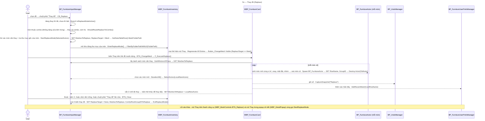
**Kiểm chứng K2:** `CB_Replace` (nhánh bật / tắt + route combo) — 2026-08-03 · thân `StartReplaceMode` (SET MeshesToReplace, ReplaceTarget, tra DT, `EnterReplaceMode` → `FilterByFolderPathWithUI`) — 2026-07-24 · `CARD→IM` lấy manager (Phần 3c). Còn lại theo doc — thân `F_ExecuteReplace` v1.6, `EnterReplaceMode` (4 dòng thêm 30/07 chưa re-export), `BTN_Close` v02/08.
**Lưu ý:** `StartReplaceMode` lấy inventory qua `Foff_GameInstance.FurnitureInventoryRef` (theo K2 24/07), khác các chỗ mới hơn lấy qua `BP_FurnitureSceneManager` — 2 đường cùng trỏ 1 widget.
Nguồn: `Blueprints/BP_FurnitureInputManager.md` (CB_Replace ✓K2 03/08, StartReplaceMode ✓K2 24/07) · `Widgets/WBP_DragOverlay_FurnitureCard.md` (F_ExecuteReplace) · `Widgets/WBP_FurnitureCard.md` · `Widgets/WBP_FurnitureInventory.md` (EnterReplaceMode, ExitReplaceMode, BTN_Close) · `Widgets/WBP_MeshControls.md` (BTN_Replace).

### 5o — Đổi vật liệu bằng cách bấm thẻ (1 hoặc nhiều món)

```mermaid
---
title: "5o — Đổi vật liệu bằng cách bấm thẻ (1 hoặc nhiều món)"
---
sequenceDiagram
  actor U as User
  participant MAT as WBP_MaterialCard
  participant INV as WBP_FurnitureInventory
  participant IM as BP_FurnitureInputManager
  participant MSS as MaterialSlotService (C++)
  participant PREFS as BP_FurnitureUserPrefsManager
  participant UM as BP_UndoManager
  Note over U,UM: Trước đó - đã chọn đồ (5a) và đang ở tab Vật liệu với 1 slot được chọn (bấm ô slot, hoặc bấm thẳng lên mesh → NotifyViewportSlotClick).
  U->>MAT: bấm 1 thẻ vật liệu · Button_ChangeMaterial
  MAT-->>INV: áp cho món đang mở panel · ApplyMaterial(RowName)
  INV-->>INV: cần món + slot hợp lệ → tra DT lấy đường dẫn · SET PendingRowName, PendingMaterialPath → LoadAndApplyMaterial
  INV->>INV: tải vật liệu (async) · Async Load Asset → Cast To MaterialInterface
  INV->>MSS: gắn vào slot của món chính, ghi MaterialSlots · ApplyLoadedMaterialToSlot()
  INV->>IM: lấy danh sách đang chọn · GET SelectedActors
  alt từ 2 món trở lên, tất cả cùng RowName
    INV->>MSS: áp tiếp cho từng món phụ, dùng lại vật liệu đã tải · ApplyLoadedMaterialToSlot() → Toast "Áp cho N/N đồ"
  else từ 2 món, khác loại
    INV->>INV: chỉ đổi món chính · Toast "Chỉ áp cho món đang chọn - N món khác loại chưa đổi"
  end
  INV->>INV: cập nhật ảnh ô slot · SerializeSlotRecords → UpdateThumbnail
  INV->>INV: hẹn ghi sổ 0.5s, bấm liên tục chỉ ghi 1 lần · SetTimer("CaptureMaterialSnapshot", 0.5)
  INV->>PREFS: thêm vào Gần đây · AddRecentMaterial(PendingRowName)
  INV-->>UM: 0.5s sau - ghi sổ · CaptureMaterialSnapshot → CaptureSnapshot("ChangeMaterial")
```
**Kiểm chứng K2:** thân `LoadAndApplyMaterial` (tải, gắn slot, multi-apply Hướng B, 2 Toast, SerializeSlotRecords, hẹn giờ, AddRecentMaterial) — as-built K2 + test 5/5, 2026-09-05. Còn lại theo doc: `Button_ChangeMaterial → ApplyMaterial` (v1.1), thân timer `CaptureMaterialSnapshot` (`Blueprint_Logic_NodeFlow.md`).
Nguồn: `Widgets/WBP_MaterialCard.md` (Button_ChangeMaterial) · `Widgets/WBP_FurnitureInventory.md` (ApplyMaterial, LoadAndApplyMaterial AS-BUILT 05/09) · `Features/ChangeMaterial.md` · `Data/MaterialSlotService_Reference.md`.

### 5p — Đổi vật liệu bằng cách kéo thẻ thả lên đồ

```mermaid
---
title: "5p — Đổi vật liệu bằng cách kéo thẻ thả lên đồ"
---
sequenceDiagram
  actor U as User
  participant MAT as WBP_MaterialCard
  participant DO as WBP_DragOverlay (lớp phủ lúc kéo)
  participant MSS as MaterialSlotService (C++)
  participant SM as BP_FurnitureSceneManager
  participant FA as BP_FurnitureActor (món bị thả trúng)
  participant UM as BP_UndoManager
  participant PREFS as BP_FurnitureUserPrefsManager
  participant INV as WBP_FurnitureInventory
  U->>MAT: kéo 1 thẻ vật liệu · OnDragDetected
  MAT-->>DO: phủ lớp kéo-thả, chỉ có ảnh nhỏ, không có bóng 3D · Create WBP_DragOverlay + BP_DragDropOperation_Material(MaterialRowName)
  U->>DO: thả lên 1 món · On Drop (nhánh Material)
  DO->>MSS: bắn tia tại điểm thả → món + slot dưới chuột · TraceSlotUnderCursor(PC, DropScreenPos, 5000)
  alt trúng đồ nội thất
    DO->>FA: giao việc cho chính món đó · ApplyMaterialByRowName(SlotName, SlotIndex, RowName)
  else trúng tường / kiến trúc
    DO->>SM: báo lỗi nhẹ · ToastRef.ShowToast("Chỉ áp vật liệu lên đồ nội thất")
  end
  DO->>DO: gỡ lớp phủ (mọi nhánh) · Remove From Parent → Return true
  FA-->>FA: nhớ slot + RowName qua khe async rồi tải vật liệu · SET Apply_PendingSlotName, Apply_PendingSlotIndex, Apply_PendingRowName → Async Load Asset
  FA-->>MSS: gắn vật liệu vào slot · ApplyLoadedMaterialToSlot()
  FA-->>UM: ghi sổ · CaptureSnapshot("ApplyMaterial")
  FA-->>PREFS: thêm vào Gần đây · AddRecentMaterial(Apply_PendingRowName)
  FA-->>INV: nếu món này đang mở panel → chọn đúng slot, tô sáng, làm mới panel · SET SelectedSlotIndex → RefreshSlotSwatches() → HighlightSwatchByIndex() → RefreshParamPanel()
```
**Kiểm chứng K2:** router `On Drop` nhánh Material (`TraceSlotUnderCursor`, `ApplyMaterialByRowName`, Toast qua `SceneManager.ToastRef`, Remove From Parent) — as-built K2 + test 5/5, 2026-09-11. Còn lại theo doc: thẻ vật liệu `OnDragDetected` (as-built 11/09, không ghi K2), thân `ApplyMaterialByRowName` (G5.2 11/09) + đoạn X3 làm mới panel (as-built 18/09, test PASS).
Nguồn: `Widgets/WBP_MaterialCard.md` (OnDragDetected, BP_DragDropOperation_Material) · `Widgets/WBP_DragOverlay_FurnitureCard.md` ([MATERIAL DROP]) · `Blueprints/BP_FurnitureActor.md` (ApplyMaterialByRowName) · `Data/MaterialSlotService_Reference.md` (TraceSlotUnderCursor).

### 5q — Lưu combo (lưu mới · ghi đè)

```mermaid
---
title: "5q — Lưu combo (lưu mới · ghi đè)"
---
sequenceDiagram
  actor U as User
  participant IM as BP_FurnitureInputManager
  participant INV as WBP_FurnitureInventory
  participant DLG as WBP_SaveComboDialog
  participant CM as BP_ComboManager
  participant SER as UComboSerializer (C++)
  participant TH as UComboThumbnail
  U->>IM: chọn từ 2 món → chuột phải "Lưu combo" · CB_SaveCombo → CB_SaveCombo_Handler
  IM->>IM: dưới 2 món → chặn im lặng, không báo gì · Branch(Length ≥ 2)
  IM->>IM: tính điểm neo (tâm XY + đáy theo sàn / trần) · CalculateComboAnchor(SelectedActors)
  IM->>IM: tìm kho đồ, không có thì chỉ in log · GetAllWidgetsOfClass(WBP_FurnitureInventory) → IsValid
  IM->>IM: đang đứng trong 1 combo có sẵn → cho phép Ghi đè · ResolveActiveComboForSave()
  IM->>INV: mở hộp thoại, đóng băng danh sách đồ · OpenSaveComboDialog(SelectedActors, Center, ActiveComboID, bCanOverwrite, ReasonText)
  IM->>IM: đóng menu chuột phải · ContextMenuRef.Hide() → SET ContextMenuRef = None
  INV-->>DLG: tạo hộp thoại điền sẵn tên / thư mục / tag, gắn 3 nút · Create WBP_SaveComboDialog → Bind OnDialogConfirmed, OnDialogConfirmedOverwrite, OnDialogCancelled
  U->>DLG: chọn thư mục, đặt tên → Lưu mới / Ghi đè / Huỷ
  DLG-->>INV: báo tin nút đã bấm · Broadcast OnDialogConfirmed / OnDialogConfirmedOverwrite / OnDialogCancelled
  INV-->>CM: lưu (Ghi đè = bOverwrite true + ComboID cũ) · SaveComboFromSelection(PendingSelectedActors, PendingCenter, tên, mô tả, thư mục, tags)
  CM-->>CM: gom nhóm con (LCA) → token g0, g1… → từng món (RowName, vị trí tương đối, MaterialSlots) + BoundingBoxExtent · Make FComboData
  CM-->>SER: ghi file JSON · ComboToJson() → SaveStringToFile
  CM->>TH: chụp ảnh bìa ở studio ảo xa phòng · BeginThumbnailCapture() → BeginComboCapture / FinishComboCapture
  CM-->>INV: chụp xong mới báo tin → tab Combo nạp lại · Broadcast OnComboLibraryChanged
  INV-->>INV: đóng hộp thoại, trả lại input cho viewport · OnSaveComboDialogClosed → Set Input Mode Game And UI
  Note over U,TH: Lưu combo KHÔNG ghi sổ Undo - đây là thao tác thư viện (file JSON), cảnh không đổi.
```
**Kiểm chứng K2:** thân `CB_SaveCombo_Handler` (guard ≥2, `CalculateComboAnchor`, `OpenSaveComboDialog`) — 2026-08-04; `ResolveActiveComboForSave` + 3 tham số — 2026-09-25 · Bước 7 chụp ảnh bìa (`BeginThumbnailCapture`) — tái xác nhận 2026-08-04. Còn lại theo doc + test (Save As / Ghi đè ✓TEST 07/08).
Nguồn: `Blueprints/BP_FurnitureInputManager.md` (CB_SaveCombo_Handler ✓K2 04/08, ResolveActiveComboForSave) · `Widgets/WBP_FurnitureInventory.md` (C3b — OpenSaveComboDialog, OnSaveComboConfirmed, HandleSaveComboOverwriteConfirmed, OnSaveComboDialogClosed) · `Widgets/WBP_SaveComboDialog.md` · `Blueprints/BP_ComboManager.md` (SaveComboFromSelection) · `Data/ComboSerializer_Reference.md`.

### 5r — Đặt combo từ thư viện vào phòng

```mermaid
---
title: "5r — Đặt combo từ thư viện vào phòng"
---
sequenceDiagram
  actor U as User
  participant CC as WBP_ComboCard
  participant GH as BP_ComboGhostActor
  participant DO as WBP_DragOverlay (lớp phủ lúc kéo)
  participant CM as BP_ComboManager
  participant IM as BP_FurnitureInputManager
  participant UM as BP_UndoManager
  U->>CC: kéo 1 thẻ combo (tab Combo) · On Drag Detected
  CC-->>GH: sinh khối bóng đúng kích thước combo · Spawn BP_ComboGhostActor(BoundingBoxExtent)
  CC-->>CC: gói kéo-thả mang ComboID + kích thước · Create BP_DragDropOperation_ComboCard
  loop mỗi lần rê chuột
    DO-->>GH: đặt bóng lên điểm chạm, đáy khớp sàn · Cast BP_ComboGhostActor → HitLocation + GhostExtentZ
  end
  U->>DO: thả · On Drop (nhánh Combo)
  DO-->>CM: đặt combo tại điểm sàn (trừ lại nửa chiều cao bóng) · SpawnComboByID(ComboID, SpawnLocation)
  DO-->>GH: huỷ bóng, gỡ lớp phủ · Destroy Actor → Remove From Parent
  CM-->>CM: chặn lệnh chồng khi đang sinh · Branch Cmb_bSpawnInFlight
  CM-->>IM: đang sửa nhóm thì thoát hẳn trước · ExitEditModeFull()
  CM-->>CM: đọc JSON, dựng nhóm mới với GUID mới cho từng token · F_LoadComboData → F_BuildTokenGUIDMap → F_RegisterComboGroups
  loop mỗi món trong combo
    CM-->>IM: sinh món (mesh tra từ DT) tại điểm đặt + vị trí tương đối · SpawnFurnitureCopy() → SET RowName, GroupID, MaterialSlots
  end
  CM-->>IM: chọn cả cụm · DeselectAll() → SelectActors(Cmb_SpawnedActors)
  CM-->>UM: cả cụm = 1 entry · CaptureSnapshot("SpawnCombo")
  Note over U,UM: RowName không còn trong DT → bỏ qua món đó + Toast, vẫn tính thành công. 0 món sinh được = thất bại (Cmb_LastSpawnSucceeded = False, dùng cho 5s).
```
**Kiểm chứng K2:** chưa có — toàn bộ theo doc + test (C2 7/7 PASS 22/06). Nhánh Combo của `On Drop` nằm trong export 11/09 nhưng doc chỉ chốt riêng nhánh Material.
**?** Doc thẻ combo không ghi ai tạo lớp `WBP_DragOverlay` lúc kéo combo (thẻ đồ thì tự tạo) — xem `01_Session_State.md` mục KIẾN TRÚC HIỆN TẠI.
Nguồn: `Widgets/WBP_ComboCard.md` (On Drag Detected) · `Widgets/WBP_DragOverlay_FurnitureCard.md` (On Drag Over, On Drop nhánh combo) · `Blueprints/BP_ComboManager.md` (SpawnComboByID Sub-step A–D, F_LoadComboData, F_RegisterComboGroups) · `Blueprints/BP_ComboGhostActor.md`.

### 5s — Thay cả combo

```mermaid
---
title: "5s — Thay cả combo"
---
sequenceDiagram
  actor U as User
  participant IM as BP_FurnitureInputManager
  participant INV as WBP_FurnitureInventory
  participant CC as WBP_ComboCard
  participant CM as BP_ComboManager
  participant UM as BP_UndoManager
  U->>IM: chuột phải "Thay đồ" trên 1 món thuộc combo · CB_Replace
  IM->>IM: món thuộc combo, không đang sửa bên trong → thay cả cụm · ShouldRouteReplaceToCombo() → StartReplaceComboMode(RootGroupID, ComboID)
  IM-->>INV: mở tab Combo đúng thư mục của combo gốc, thẻ hiện nút Thay · EnsureExpanded() → SwitchInventoryMode(Combo) → FilterComboByFolder() → RefreshComboCardReplaceMode()
  U->>CC: bấm Thay trên thẻ combo muốn dùng · BTN_ChangeCombo
  CC-->>IM: thẻ chỉ gọi đúng 1 node · ExecuteComboReplace(NewComboID)
  IM->>CM: thay · ReplaceCombo(ComboRootGroupIDToReplace, NewComboID)
  CM-->>IM: gom cụm cũ, tính điểm neo, xoá cụm cũ · GetAllDescendantActors() → CalculateComboAnchor() → DestroyComboCluster()
  CM-->>CM: đặt combo mới tại điểm neo (như 5r) · SpawnComboByID(NewComboID, Cmb_ReplaceAnchor, "ReplaceCombo")
  alt không sinh được món nào
    CM-->>UM: khôi phục cụm cũ tại chỗ, không lùi sổ · RestoreCurrentSnapshot() → Toast "Thay thế thất bại"
  end
  IM-->>IM: nhắm vào cụm mới để thay tiếp được · ResolveSelectedComboRoot() → SET ComboRootGroupIDToReplace
```
**Kiểm chứng K2:** `CB_Replace` route combo — 2026-08-03 · `IM→CM ExecuteComboReplace → ReplaceCombo` (Phần 3b). Còn lại theo doc + test PIE (Replace UX Fix 01/08, test ReplaceCombo 4 ca).
Nguồn: `Blueprints/BP_FurnitureInputManager.md` (CB_Replace, ShouldRouteReplaceToCombo, StartReplaceComboMode, ExecuteComboReplace, ResolveSelectedComboRoot, DestroyComboCluster) · `Widgets/WBP_ComboCard.md` (BTN_ChangeCombo) · `Blueprints/BP_ComboManager.md` (ReplaceCombo) · `Blueprints/BP_UndoManager.md` (RestoreCurrentSnapshot).

### 5t — Lưu cảnh và mở lại cảnh (EMS)

```mermaid
---
title: "5t — Lưu cảnh và mở lại cảnh (EMS)"
---
sequenceDiagram
  actor U as User
  participant SGM as SaveGameMenu (menu Save/Load của project tổng)
  participant SM as BP_FurnitureSceneManager
  participant IM as BP_FurnitureInputManager
  participant FA as BP_FurnitureActor (mỗi món)
  participant EIL as UEntityIdLibrary (C++)
  participant MSS as MaterialSlotService (C++)
  U->>SGM: phím M mở menu Save/Load → chọn / đặt tên slot → Save
  Note over U,MSS: EMS ghi mọi actor có biến SaveGame - mỗi món (MeshPath, RowName, PlacementSurfaceType, GroupID, PersistentID, MaterialSlots) và BP_GroupsContainer (Groups, GroupNameCounter).
  U->>SGM: bấm Load trong menu Save/Load
  SGM-->>SM: báo tin, SM tự bind lại mỗi Tick khi menu mới xuất hiện · OnLoadButtonClicked
  SM-->>IM: bỏ chọn + tắt gizmo TRƯỚC khi xoá · DeselectMesh()
  SM-->>FA: xoá hết đồ đang có · Destroy Actor (tag FurnitureSpawned)
  Note over SM,FA: EMS nạp lại actor từ slot (Load Game Actors, Full Reload). SM có định nghĩa SaveFurnitureScene() / LoadFurnitureScene() nhưng chưa rõ menu có gọi 2 event này không (?).
  FA-->>FA: chờ EMS nạp xong biến SaveGame, MeshPath rỗng thì tự huỷ · Event ActorLoaded → AsyncWaitForOperation(CT_Load)
  FA-->>EIL: giữ danh tính cũ, chỉ sinh mới khi rỗng · EnsurePersistentId()
  FA-->>FA: nạp mesh (đồng bộ) · LoadAsset_Blocking(MeshPath) → SetStaticMesh
  FA-->>MSS: gắn lại vật liệu + thông số từng slot · RestoreMyMaterialSlots → Rst_LoadNextSlot → ApplyLoadedMaterialToSlot() → ApplyParamsJsonToSlot()
  Note over U,MSS: ⚠ Sổ Undo KHÔNG bị xoá khi Load — Ctrl+Z ngay sau Load đưa về cảnh TRƯỚC Load (PIE 25/09). Xem Open_Bugs Bug-UndoAcrossLoad.
```
**Kiểm chứng K2:** chưa có mũi tên liền. `Event ActorLoaded` bản 07/09 dịch từ K2 (delta S7.G3), bản hiện hành chèn thêm `EnsurePersistentId` 21/09 (PIE, chưa K2).
**Đã rõ (25/09, PIE — cuhoang):** lưu / mở cảnh qua **menu Save/Load của project (phím M)** — nút Load / Save / Delete / Back; Ctrl+S / Ctrl+O KHÔNG có (danh sách phím tắt cũ ghi sai, đã sửa). Sổ Undo KHÔNG xoá khi Load.
**?** `SaveFurnitureScene` / `LoadFurnitureScene` định nghĩa ở `BP_FurnitureSceneManager` — chưa rõ menu có gọi không (có thể không dùng).
Nguồn: `Blueprints/BP_FurnitureSceneManager.md` (Event Tick, OnLoadButtonClicked, SaveFurnitureScene, LoadFurnitureScene) · `Blueprints/BP_FurnitureActor.md` (Event ActorLoaded, RestoreMyMaterialSlots, Rst_LoadNextSlot) · `Widgets/WBP_FurnitureInventory.md` (Keyboard Shortcuts, EMS).

---

## Hướng dẫn điền dần (Phần 2 & 3)

Phần 1 + Phần 4 tĩnh. Phần 2 + Phần 3: mũi tên rút từ mô tả flow trong canonical doc (DEVIATION cuhoang 28/08 — xem đầu file).

**Trạng thái mũi tên hiện tại:**
- **Nét liền `-->`** = canonical doc nói `✓K2Node` cho quan hệ đó. Nhãn `[K2 dd/mm]`.
- **Nét đứt `-.->`** = doc mô tả flow nhưng KHÔNG nói K2. Nhãn `[DOC]`. = "chưa chắc, chờ K2 nâng cấp".

**Nâng `[DOC] → [K2]`:**
1. Cuhoang gửi K2 export vùng node liên quan (chat Opus hoặc Claude Code).
2. Đối chiếu export: xác nhận nguồn/đích/function/loại quan hệ khớp mũi tên đang có.
3. Đổi `-.->` → `-->`, nhãn `[DOC]` → `[K2 dd/mm]`.
4. Nếu export cho thấy quan hệ KHÁC mô tả doc → ghi `CONFLICT:` dưới sơ đồ, giữ nét đứt tới khi cuhoang chốt.
5. Chạy `python Brain/_tools/build.py` (thư mục `docs`) → mở `Brain/Kiểm tra bản đồ.md`: mục ❌ (thiếu cạnh) và ⚠ (Phần 3 tụt bằng chứng) phải bằng 0 — Phần 3 và Phần 5 cùng 1 quan hệ thì cùng 1 mức bằng chứng. *(thêm v1.7)*

**KHÔNG tự phát minh quan hệ** không có trong doc. Doc không nhắc → không vẽ.
