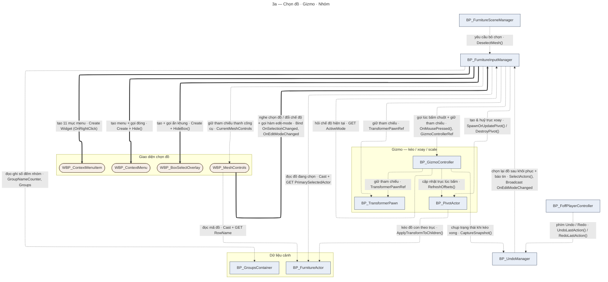
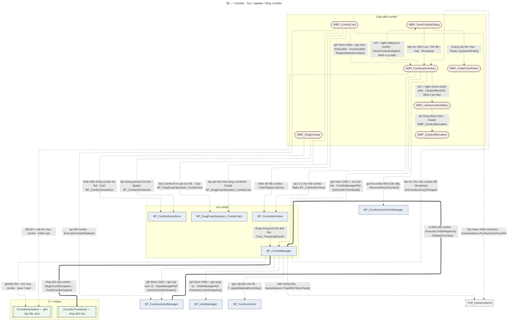
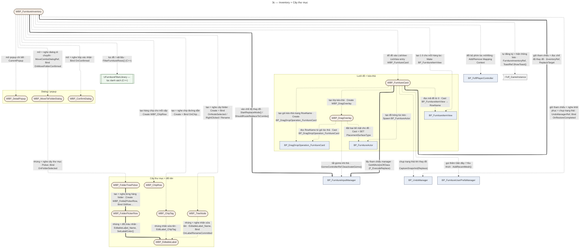
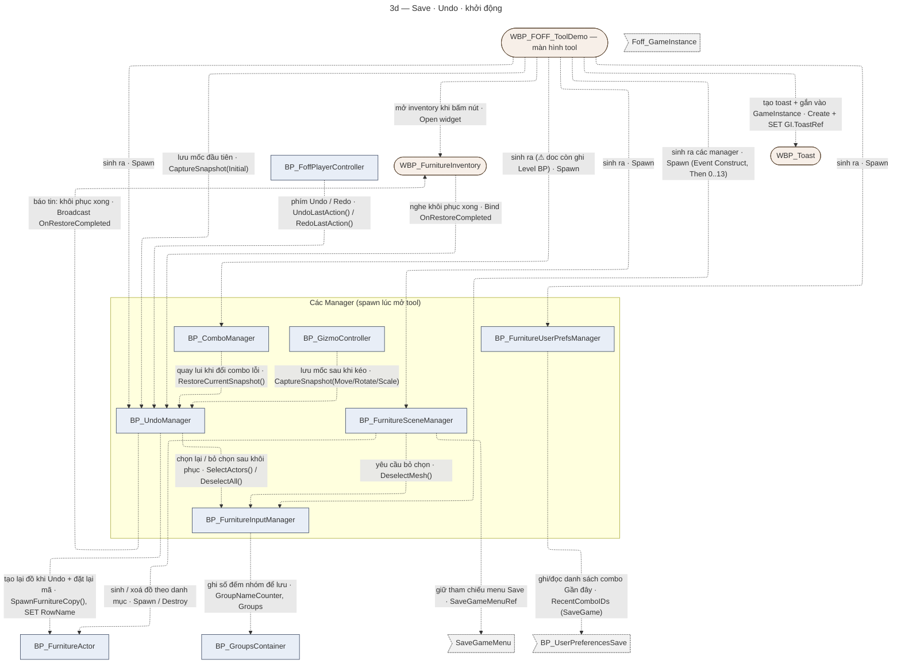
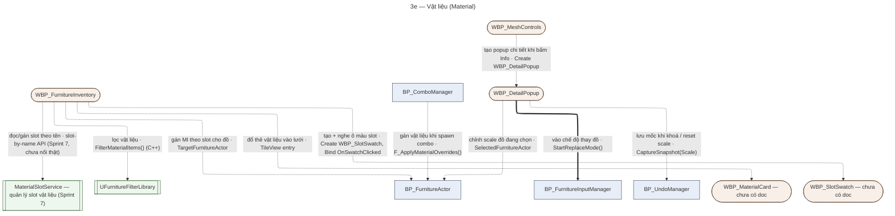

# Architecture Map — UE5 Interior Tool

**Phiên bản:** 0.7 (+3 BP: UserPreferencesSave, 2× DragDropOperation; FurnitureRowRef = dead) | **Tạo:** 28/08/2026 15:59 | **Cập nhật:** 29/08/2026 00:42 | **Người dựng:** Claude Code (theo handoff Opus 22/08/2026)

> **DEVIATION so với handoff (cuhoang chỉ đạo 28/08/2026):** handoff gốc yêu cầu Phần 2/3 = khung rỗng, chỉ điền từ K2. cuhoang đổi: Claude Code ĐƯỢC rút quan hệ **từ mô tả flow trong canonical doc** — KHÔNG tự suy luận. Doc nói "✓K2Node" cho quan hệ đó → nét liền `[K2]`. Còn lại → nét đứt `[DOC]`. Claude Code vẫn KHÔNG được bịa quan hệ không có trong doc.
>
> **Trạng thái:** Phần 0 / 1 / 4 = TĨNH. Phần 2 / 3 = khung đầy đủ node; mũi tên rút dần từ doc + nâng cấp lên `[K2]` khi có export.
>
> **Nguồn:** quét `docs/Blueprints/` `docs/Widgets/` `docs/Data/` ngày 28/08/2026.
>
> **Quy ước trình bày:** xem `.claude/skills/arch-map/references/diagram-contract.md`.
> Tóm tắt: `-->` nét liền = K2/live verify · `-.->` nét đứt = chưa verify (kèm `?`) · `["BP"]` bo vuông · `(["WBP"])` bo tròn · `[["C++ Service"]]` vạch đôi · `[("Data")]` cylinder · nhãn evidence `[K2 YYYY-MM-DD]` / `[DOC]` / `[?]`.

---

## Tiêu chí đưa node vào bản đồ

Bản đồ KHÔNG xét component lớn/nhỏ, chỉ xét **có nằm trên đường giao tiếp của code không**.

- **Asset thật** + có **Event / Function / Dispatcher / Reference** nối sang component khác → **đưa vào** (dạng node).
- Chỉ là **widget variable / container thuần**, không có logic riêng → **không** node riêng.

---

## Phần 0 — Danh sách asset (nền cho mọi phần)

Chỉ liệt kê asset THẬT (có canonical doc riêng hoặc version history). Cột **Parent** lấy từ header canonical doc — mức `[DOC]`, CHƯA K2.

### 0.1 — Blueprints có canonical doc (11)

| Blueprint | Parent (theo doc, `[DOC]`) | Chức năng chính (1 dòng) |
|---|---|---|
| `BP_FurnitureInputManager` | Actor | Core hub — input · multi-select · box-select · context-menu · group · edit-mode |
| `BP_UndoManager` | Actor | Undo/Redo stack — `S_SceneSnapshot` V4 + EditModeStack |
| `BP_ComboManager` | Actor | Combo logic — save / spawn / replace (Sprint 5); nhận data qua param (R2) |
| `BP_FurnitureSceneManager` | Actor | EMS Save/Load; spawn/destroy furniture actor theo catalog |
| `BP_FurnitureUserPrefsManager` | Actor *(cuhoang xác nhận 28/08/2026)* | UserPrefs Favorite/Recent combo — persist qua EMS SaveGame |
| `BP_GizmoController` | Actor | Gizmo movement logic — TransformMode, axis drag, ray-plane, snap |
| `BP_PivotActor` | StaticMeshActor *(DEVIATION T3)* | Pivot vô hình cho multi-gizmo move/rotate/scale |
| `BP_FurnitureActor` | StaticMeshActor · impl `EMSActorSaveInterface` | Từng đồ nội thất trong scene — SaveGame vars (MeshPath/RowName/MaterialOverrides) |
| `BP_ComboGhostActor` | Actor | Ghost preview bounding-box của combo trong lúc drag |
| `BP_ComboItemView` | Object *(không Actor)* | Bọc `FComboData` thành UObject cho `CTV_ComboCard` (TileView tab Combo) |
| `BP_FoffPlayerController` | Player Controller *(project tổng)* | Add/Remove `LM_FurnitureInput` Mapping Context + bind Enhanced Input Undo/Redo |

### 0.2 — Widgets có canonical doc (19)

| Widget | Chức năng chính (1 dòng) |
|---|---|
| `WBP_FurnitureInventory` | Inventory chính — filter · search · folder tree · pagination · Material Editor (v1.1) · Resize · Replace |
| `WBP_MeshControls` | Persistent toolbar — Move/Rotate/Scale/Delete · info bar · edit-mode breadcrumb |
| `WBP_ResizeWindow` | Resize 8 hướng cho `WBP_FurnitureInventory` (logic-only feature doc) |
| `WBP_BoxSelectOverlay` | Khung rubber-band box-select — chỉ HIỂN THỊ, logic ở `BP_FurnitureInputManager` |
| `WBP_DetailPopup` | Popup thông tin sản phẩm + Scale editor |
| `WBP_FurnitureCard` | Card 1 mặt hàng nội thất — `IUserObjectListEntry`, nhận `BP_FurnitureItemView` từ ListView |
| `WBP_ComboCard` | Card 1 combo trong tab Combo — `IUserObjectListEntry`, nhận `BP_ComboItemView` từ `CTV_ComboCard` |
| `WBP_DragOverlay` | Overlay drag & drop khi kéo `WBP_FurnitureCard` — doc chung ở `WBP_DragOverlay_FurnitureCard.md` (kèm nội dung `WBP_FurnitureCard` legacy pre-D.T6) |
| `WBP_TreeNode` | Node 1 cấp folder trong cây của `WBP_FurnitureInventory` |
| `WBP_ChipTag` | Chip 1 folder con trong breadcrumb area — chứa trong `WBP_ChipRow` |
| `WBP_EditableLabel` | Component inline-rename tái dùng (Content Browser style) |
| `WBP_FolderTreePicker` | Lớp-2 shared tree picker — nhúng vào Move/Save dialog |
| `WBP_FolderPickerRow` | Row của `WBP_FolderTreePicker` (C5.8) |
| `WBP_LibraryContextMenu` | Context menu Combo Library — clone `WBP_ContextMenu` |
| `WBP_ConfirmDialog` | Dialog Yes/No generic — không chứa logic nghiệp vụ |
| `WBP_SaveComboDialog` | Dialog async nhập tên/folder/tags khi lưu combo + Save As / Save Đè |
| `WBP_MoveToFolderDialog` | Dialog modal chọn folder cha đích khi move folder |
| `WBP_MoveFolderRow` | **[SUPERSEDED]** bởi `WBP_FolderPickerRow` — file giữ tham chiếu lịch sử |
| `WBP_Toast` | Toast global — truy cập qua `Foff_GameInstance.ToastRef` |

### 0.3 — C++ Services có reference doc (4) — KHÔNG phải Blueprint

Giữ vì có trách nhiệm domain / data boundary / performance boundary hoặc được BP/WBP gọi trực tiếp. KHÔNG bung hàm/internal vào sơ đồ chính.

| Service | Trách nhiệm | Reference doc |
|---|---|---|
| `UComboSerializer` | Combo save/load JSON + folder ops (13 hàm public) | `Data/ComboSerializer_Reference.md` |
| `UComboThumbnail` | Capture/load thumbnail PNG (SSAA 2× + temporal accumulation N=24) | `Data/ComboSerializer_Reference.md` |
| `UFurnitureFilterLibrary` | Filter DataTable → Array<Name> (FilterFurnitureRows / FilterMaterialItems / GetDistinctFolderPaths) | `Data/FurnitureFilterLibrary_Reference.md` |
| `MaterialSlotService` (`UMaterialSlotService`) | Slot-by-name API cho Material Edit (Sprint 7 G1, as-built 27/08/2026) | `Data/MaterialSlotService_Reference.md` |

### 0.4 — Asset thật, CHƯA có canonical doc riêng — GIỮ trong bản đồ (chờ doc + K2)

cuhoang xác nhận 28/08/2026. Các node này vào Phần 2 (subgraph tương ứng) ở dạng chờ verify.

| Asset | Nhắc ở đâu (ví dụ) | Loại |
|---|---|---|
| `BP_TransformerPawn` | `BP_GizmoController` var `TransformerPawnRef`; kiến trúc core | BP (RuntimeTransformer pawn) |
| `BP_GroupsContainer` | `00_INDEX.md` "Kiến trúc cốt lõi (v1.9)" — SaveGame, GroupNameCounter | BP |
| `BP_FurnitureItemView` | `WBP_FurnitureCard` / `WBP_FurnitureInventory` — wrapper object cho ListView | BP (Object, sibling của `BP_ComboItemView`) |
| `WBP_ContextMenu` | Nguồn clone của `WBP_LibraryContextMenu` | WBP |
| `WBP_ContextMenuItem` | `WBP_MoveFolderRow.md` — "pattern tương tự" | WBP |
| `WBP_ChipRow` | `WBP_ChipTag.md` — container 1 cấp chip trong breadcrumb; **WBP asset có Dispatcher/logic riêng** (cuhoang xác nhận 28/08/2026) | WBP |
| `SaveGameMenu` | `BP_FurnitureSceneManager` var `SaveGameMenuRef` | UI class |
| `Foff_GameInstance` | `WBP_Toast` — `ToastRef` global | **EXTERNAL** (project tổng) — giữ có điều kiện, chỉ vẽ khi có call thật |
| `BP_UserPreferencesSave` | `BP_FurnitureUserPrefsManager` — `RecentComboIDs` / `FavoriteComboIDs`; `Data/Data_Structures.md:386` (C0), `UX_Phase2_Plan.md` | SaveGame Object |
| `BP_DragDropOperation_ComboCard` | `WBP_ComboCard.OnDragDetected` tạo (SET `ComboID`, `ComboExtent`) → `WBP_DragOverlay.On Drop` Cast đọc; `Sprint5/Combo_Execution.md:745` "class mới" | UDragDropOperation (payload card→overlay) |
| `BP_DragDropOperation_FurnitureCard` | `WBP_FurnitureCard` / `WBP_DragOverlay` tạo (SET `RowName`) → `WBP_DragOverlay` Cast đọc; `WBP_DragOverlay_FurnitureCard.md:146` | UDragDropOperation (payload card→overlay) |

**Đã loại:**
- `CTV_ComboCard` — tên biến TileView entry, không phải asset.
- `BP_FurnitureRowRef` — **dead / orphan**: 0 referencers trong project (cuhoang 29/08/2026), doc không nhắc. Code thừa hoặc đã bị thay. KHÔNG đưa vào bản đồ; KHÔNG xoá (asset binary, ngoài phạm vi Claude Code) — cuhoang tự dọn nếu muốn.
- `WBP_DragOverlay` KHÔNG loại — đã có doc, nằm ở Phần 0.2.

**Còn có** `WBP_DragVisual` (`WBP_FurnitureCard.md:138` "Create WBP_DragVisual") — widget hiển thị lúc kéo, chưa đưa vào (thuần visual, không logic). Cân nhắc khi review.

---

## Phần 1 — Folder tree (path `/Game/...` trong project UE)

> Canonical docs **không ghi** content path của bản thân từng BP/Widget. Không đoán. Đa số = `(path /Game chưa rõ trong doc)`.

```
(project UE — path asset chưa rõ trong doc)
│
├── Blueprints  ── path /Game chưa rõ trong doc
│   ├── BP_FurnitureInputManager
│   ├── BP_UndoManager
│   ├── BP_ComboManager
│   ├── BP_FurnitureSceneManager
│   ├── BP_FurnitureUserPrefsManager
│   ├── BP_GizmoController
│   ├── BP_PivotActor
│   ├── BP_FurnitureActor
│   ├── BP_ComboGhostActor
│   ├── BP_ComboItemView
│   └── BP_FoffPlayerController   (project tổng — ngoài plugin)
│
├── Widgets  ── path /Game chưa rõ trong doc
│   ├── WBP_FurnitureInventory
│   ├── WBP_MeshControls
│   ├── WBP_ResizeWindow
│   ├── WBP_BoxSelectOverlay
│   ├── WBP_DetailPopup
│   ├── WBP_FurnitureCard
│   ├── WBP_ComboCard
│   ├── WBP_DragOverlay
│   ├── WBP_TreeNode
│   ├── WBP_ChipTag
│   ├── WBP_EditableLabel
│   ├── WBP_FolderTreePicker
│   ├── WBP_FolderPickerRow
│   ├── WBP_LibraryContextMenu
│   ├── WBP_ConfirmDialog
│   ├── WBP_SaveComboDialog
│   ├── WBP_MoveToFolderDialog
│   ├── WBP_MoveFolderRow   [SUPERSEDED]
│   └── WBP_Toast
│
└── C++  (plugin FurnitureToolkit)  ── path source chưa ghi trong doc
    ├── UComboSerializer / UComboThumbnail
    ├── UFurnitureFilterLibrary
    └── MaterialSlotService
```

**Data locations có ghi trong doc** (là path DỮ LIỆU, không phải path asset BP/Widget — nguồn: `WBP_FurnitureInventory.md`):

```
Mesh : /Game/DatabaseProjectMaster/Model/Object_Model/
MI   : /Game/DatabaseProjectMaster/Material/MaterialInstances/   (~2738 rows)
DT   : /Game/cuong/UI/Data/DT_FurnitureCatalog
DA   : /Game/cuong/UI/Data/FurnitureAssets/                      (legacy sau Sprint D)
```

---

## Phần 2 — Gia phả (khung đầy đủ — chưa mũi tên)

> Mọi node từ Phần 0 (gồm §0.4). Nhóm bằng subgraph theo chức năng. **Chưa mũi tên kế thừa** — inheritance rút từ doc/K2 sau (§5). Parent class ở Phần 0 mức `[DOC]`/`[cuhoang xác nhận]`.
>
> Shape: `["BP"]` vuông · `(["WBP"])` bo tròn · `[["C++"]]` vạch đôi · `>"EXTERNAL"]` cờ.

```mermaid
---
title: "Bản đồ kiến trúc — Danh sách component (nhóm theo loại)"
---
flowchart TB
    subgraph MANAGERS["Managers / Hubs (Actor)"]
        IM["BP_FurnitureInputManager"]
        UNDO["BP_UndoManager"]
        COMBO["BP_ComboManager"]
        SCENE["BP_FurnitureSceneManager"]
        PREFS["BP_FurnitureUserPrefsManager"]
        GIZMO["BP_GizmoController"]
    end

    subgraph SCENE_ACTORS["Scene Actors"]
        FA["BP_FurnitureActor"]
        PIVOT["BP_PivotActor"]
        GHOST["BP_ComboGhostActor"]
        TPAWN["BP_TransformerPawn (no doc)"]
    end

    subgraph STATE["State / SaveGame"]
        GROUPS["BP_GroupsContainer (no doc)"]
        UPS["BP_UserPreferencesSave (no doc)"]
    end

    subgraph VIEW_OBJ["View / Payload Objects (UObject)"]
        CIV["BP_ComboItemView"]
        FIV["BP_FurnitureItemView (no doc)"]
        DDCOMBO["BP_DragDropOperation_ComboCard (no doc)"]
        DDFURN["BP_DragDropOperation_FurnitureCard (no doc)"]
    end

    subgraph CONTROLLER["Controller (project tổng)"]
        PC["BP_FoffPlayerController"]
    end

    subgraph W_SHELL["Widgets — shell / toolbar"]
        INV(["WBP_FurnitureInventory"])
        MESHCTRL(["WBP_MeshControls"])
        RESIZE(["WBP_ResizeWindow"])
        BOXSEL(["WBP_BoxSelectOverlay"])
    end

    subgraph W_CARDS["Widgets — cards / rows"]
        FCARD(["WBP_FurnitureCard"])
        CCARD(["WBP_ComboCard"])
        TREENODE(["WBP_TreeNode"])
        CHIPTAG(["WBP_ChipTag"])
        CHIPROW(["WBP_ChipRow (no doc)"])
        FPROW(["WBP_FolderPickerRow"])
        MFROW(["WBP_MoveFolderRow [SUPERSEDED]"])
    end

    subgraph W_DIALOG["Widgets — dialogs / popup"]
        CONFIRM(["WBP_ConfirmDialog"])
        SAVECOMBO(["WBP_SaveComboDialog"])
        MOVEDLG(["WBP_MoveToFolderDialog"])
        DETAIL(["WBP_DetailPopup"])
    end

    subgraph W_SHARED["Widgets — shared / global"]
        EDITLABEL(["WBP_EditableLabel"])
        FTPICKER(["WBP_FolderTreePicker"])
        LIBCTX(["WBP_LibraryContextMenu"])
        CTX(["WBP_ContextMenu (no doc)"])
        CTXITEM(["WBP_ContextMenuItem (no doc)"])
        TOAST(["WBP_Toast"])
        DRAGOV(["WBP_DragOverlay"])
    end

    subgraph CPP["C++ Services"]
        SERZ[["UComboSerializer"]]
        THUMB[["UComboThumbnail"]]
        FFL[["UFurnitureFilterLibrary"]]
        MSS[["MaterialSlotService"]]
    end

    subgraph EXT["EXTERNAL / project tổng"]
        GI>"Foff_GameInstance"]
        SGMENU>"SaveGameMenu"]
    end

    classDef bp fill:#e8eef7,stroke:#33415c;
    classDef wbp fill:#f7efe8,stroke:#5c4633;
    classDef svc fill:#eef7ee,stroke:#356335;
    classDef ext fill:#f2f2f2,stroke:#888,stroke-dasharray:3 2;
    class IM,UNDO,COMBO,SCENE,PREFS,GIZMO,FA,PIVOT,GHOST,TPAWN,GROUPS,UPS,CIV,FIV,DDCOMBO,DDFURN,PC bp;
    class INV,MESHCTRL,RESIZE,BOXSEL,FCARD,CCARD,TREENODE,CHIPTAG,CHIPROW,FPROW,MFROW,CONFIRM,SAVECOMBO,MOVEDLG,DETAIL,EDITLABEL,FTPICKER,LIBCTX,CTX,CTXITEM,TOAST,DRAGOV wbp;
    class SERZ,THUMB,FFL,MSS svc;
    class GI,SGMENU ext;
```



**Kế thừa / clone đáng ghi nhận** (hệ phân cấp phẳng — hầu hết off `Actor`/`UserWidget`, không vẽ):

| Quan hệ | Nguồn |
|---|---|
| `WBP_LibraryContextMenu` ← clone ← `WBP_ContextMenu` | `WBP_LibraryContextMenu.md` "Clone từ WBP_ContextMenu" — `[DOC]` |
| `WBP_MoveFolderRow` ← superseded-by ← `WBP_FolderPickerRow` | `WBP_MoveFolderRow.md` "[SUPERSEDED] thay bởi WBP_FolderPickerRow" — `[DOC]` |
| `BP_PivotActor` : parent `StaticMeshActor` (KHÔNG `Actor`) | DEVIATION T3 — gizmo chỉ nhận StaticMeshActor — `[DOC]` |
| `BP_FurnitureActor` : parent `StaticMeshActor` + impl `EMSActorSaveInterface` | `BP_FurnitureActor.md` header — `[DOC]` |
| `BP_ComboItemView` / `BP_FurnitureItemView` : sibling — cùng bọc data cho List/TileView (`IUserObjectListEntry` entry data) | `[DOC]` |

---

## Phần 3 — Ai nói chuyện với ai (rút từ doc — §5)

5 sơ đồ theo mảng chức năng. 1 component xuất hiện ở nhiều sơ đồ là bình thường (hub chạm mọi nơi).

**Đọc mũi tên:**
- **Nét dày `==>`** = quan hệ đã kiểm chứng bằng K2 export (ngày ghi ở dòng "Kiểm chứng K2" cuối mỗi sơ đồ).
- **Nét đứt `-.->`** = mới theo mô tả trong canonical doc — **chưa chắc**, chờ K2.

**Chữ trên mũi tên** = câu tiếng Việt (dễ hiểu) + tên thật + loại tiếng Anh (làm quen dần):

| Câu tiếng Việt | Loại (jargon) | Nghĩa kỹ thuật |
|---|---|---|
| tạo … | `Create Widget` / `Spawn Actor` | dựng ra 1 widget/actor mới |
| tạo & huỷ … | own lifecycle | tạo + giữ + dọn khi xong |
| gọi `Foo()` | `call function/event` | ra lệnh cho bên kia chạy 1 hàm |
| nghe `OnBar` | `Bind Event to dispatcher` | đăng ký để được gọi lại khi bên kia phát sự kiện |
| báo tin `OnBar` | `Broadcast dispatcher` | phát sự kiện cho mọi bên đang nghe |
| giữ tham chiếu `X` | `object reference variable` | giữ "địa chỉ" bên kia để dùng lại |
| đọc / đọc-ghi `X` | `GET` / `SET variable` | lấy hoặc đặt giá trị biến của bên kia |
| ép kiểu → `T` | `Cast To` | kiểm tra & chuyển 1 object sang lớp cụ thể |
| chụp trạng thái | `CaptureSnapshot()` | lưu mốc để Undo quay lại |

Bố cục dùng layout **ELK** (ít rối hơn). Xem tốt nhất bằng [mermaid.live](https://mermaid.live) (pan/zoom).

### 3a — Chọn đồ · Gizmo · Nhóm



**Kiểm chứng K2:** `IM→CTX`, `IM→CTXITEM` (28/08) · `IM→BOXSEL` (24/07) · `MESHCTRL→IM` (24/07). Còn lại: theo doc.

### 3b — Combo (lưu / spawn / thay combo)



**Kiểm chứng K2:** `IM→COMBO` (02/08) · `COMBO→THUMB` (Gate F, 21/07). Còn lại: theo doc.

### 3c — Inventory + Cây thư mục



**Kiểm chứng K2:** `INV→IM` (03/08) · `FCARD→INV`, `FCARD→IM` (24/07) · `FTPICKER→FPROW` (12/07) · `FPROW→EDITLABEL` (11/07). Còn lại: theo doc.

### 3d — Save · Undo · khởi động



**Kiểm chứng K2:** `UNDO→FA` (mã RowName, 03/08). Còn lại: theo doc. ⚠ Nguồn spawn manager: doc ghi cả `WBP_FOFF_ToolDemo` lẫn "Level BP" — chưa chốt.

### 3e — Vật liệu (Material)



**Kiểm chứng K2:** `DETAIL→IM` (24/07). Còn lại: theo doc.

---

## Phần 4 — Index map

| Blueprint/Widget | Chức năng chính (1 dòng) | Canonical doc chi tiết | Trạng thái verify |
|---|---|---|---|
| `BP_FurnitureInputManager` | Core hub — input/multi-select/box-select/context-menu/group/edit-mode | `Blueprints/BP_FurnitureInputManager.md` | `[chưa rà L-DOC]` |
| `BP_UndoManager` | Undo/Redo stack — S_SceneSnapshot V4 + EditModeStack | `Blueprints/BP_UndoManager.md` | `[chưa rà L-DOC]` |
| `BP_ComboManager` | Combo logic — save/spawn/replace (Sprint 5) | `Blueprints/BP_ComboManager.md` | `[chưa rà L-DOC]` |
| `BP_FurnitureSceneManager` | EMS Save/Load; spawn/destroy furniture actor | `Blueprints/BP_FurnitureSceneManager.md` | `[chưa rà L-DOC]` |
| `BP_FurnitureUserPrefsManager` | UserPrefs Favorite/Recent combo — EMS SaveGame | `Blueprints/BP_FurnitureUserPrefsManager.md` | `[chưa rà L-DOC]` |
| `BP_GizmoController` | Gizmo movement — TransformMode, axis drag, ray-plane, snap | `Blueprints/BP_GizmoController.md` | `[chưa rà L-DOC]` |
| `BP_PivotActor` | Pivot vô hình cho multi-gizmo move/rotate/scale | `Blueprints/BP_PivotActor.md` | `[chưa rà L-DOC]` |
| `BP_FurnitureActor` | Từng đồ nội thất trong scene — SaveGame vars | `Blueprints/BP_FurnitureActor.md` | `[chưa rà L-DOC]` |
| `BP_ComboGhostActor` | Ghost preview bounding-box combo lúc drag | `Blueprints/BP_ComboGhostActor.md` | `[chưa rà L-DOC]` |
| `BP_ComboItemView` | Bọc FComboData thành UObject cho CTV_ComboCard | `Blueprints/BP_ComboItemView.md` | `[chưa rà L-DOC]` |
| `BP_FoffPlayerController` | Mapping Context + bind Enhanced Input Undo/Redo | `Blueprints/BP_FoffPlayerController.md` | `[chưa rà L-DOC]` |
| `WBP_FurnitureInventory` | Inventory chính — filter/search/folder/pagination/material/resize/replace | `Widgets/WBP_FurnitureInventory.md` | `[chưa rà L-DOC]` |
| `WBP_MeshControls` | Persistent toolbar — Move/Rotate/Scale/Delete, info bar | `Widgets/WBP_MeshControls.md` | `[chưa rà L-DOC]` |
| `WBP_ResizeWindow` | Resize 8 hướng cho WBP_FurnitureInventory | `Widgets/WBP_ResizeWindow.md` | `[chưa rà L-DOC]` |
| `WBP_BoxSelectOverlay` | Khung rubber-band box-select (display-only) | `Widgets/WBP_BoxSelectOverlay.md` | `[chưa rà L-DOC]` |
| `WBP_DetailPopup` | Popup thông tin sản phẩm + Scale editor | `Widgets/WBP_DetailPopup.md` | `[chưa rà L-DOC]` |
| `WBP_FurnitureCard` | Card 1 mặt hàng nội thất — IUserObjectListEntry | `Widgets/WBP_FurnitureCard.md` | `[chưa rà L-DOC]` |
| `WBP_ComboCard` | Card 1 combo trong tab Combo — IUserObjectListEntry | `Widgets/WBP_ComboCard.md` | `[chưa rà L-DOC]` |
| `WBP_DragOverlay` | Overlay drag & drop khi kéo furniture card | `Widgets/WBP_DragOverlay_FurnitureCard.md` | `[chưa rà L-DOC]` |
| `WBP_TreeNode` | Node 1 cấp folder trong cây WBP_FurnitureInventory | `Widgets/WBP_TreeNode.md` | `[chưa rà L-DOC]` |
| `WBP_ChipTag` | Chip 1 folder con trong breadcrumb | `Widgets/WBP_ChipTag.md` | `[chưa rà L-DOC]` |
| `WBP_EditableLabel` | Component inline-rename tái dùng | `Widgets/WBP_EditableLabel.md` | `[chưa rà L-DOC]` |
| `WBP_FolderTreePicker` | Lớp-2 shared tree picker (Move/Save dialog) | `Widgets/WBP_FolderTreePicker.md` | `[chưa rà L-DOC]` |
| `WBP_FolderPickerRow` | Row của WBP_FolderTreePicker (C5.8) | `Widgets/WBP_FolderPickerRow.md` | `[chưa rà L-DOC]` |
| `WBP_LibraryContextMenu` | Context menu Combo Library — clone WBP_ContextMenu | `Widgets/WBP_LibraryContextMenu.md` | `[chưa rà L-DOC]` |
| `WBP_ConfirmDialog` | Dialog Yes/No generic | `Widgets/WBP_ConfirmDialog.md` | `[chưa rà L-DOC]` |
| `WBP_SaveComboDialog` | Dialog nhập tên/folder/tags khi lưu combo + Save As/Đè | `Widgets/WBP_SaveComboDialog.md` | `[chưa rà L-DOC]` |
| `WBP_MoveToFolderDialog` | Dialog modal chọn folder đích khi move folder | `Widgets/WBP_MoveToFolderDialog.md` | `[chưa rà L-DOC]` |
| `WBP_MoveFolderRow` | **[SUPERSEDED]** bởi WBP_FolderPickerRow | `Widgets/WBP_MoveFolderRow.md` | `[chưa rà L-DOC]` |
| `WBP_Toast` | Toast global — Foff_GameInstance.ToastRef | `Widgets/WBP_Toast.md` | `[chưa rà L-DOC]` |
| `UComboSerializer` | C++ — combo save/load JSON + folder ops | `Data/ComboSerializer_Reference.md` | `[chưa rà L-DOC]` |
| `UComboThumbnail` | C++ — capture/load thumbnail PNG (SSAA + temporal accum) | `Data/ComboSerializer_Reference.md` | `[chưa rà L-DOC]` |
| `UFurnitureFilterLibrary` | C++ — FilterFurnitureRows / FilterMaterialItems / GetDistinctFolderPaths | `Data/FurnitureFilterLibrary_Reference.md` | `[chưa rà L-DOC]` |
| `MaterialSlotService` | C++ — slot-by-name API (Sprint 7 G1) | `Data/MaterialSlotService_Reference.md` | `[chưa rà L-DOC]` |

---

## Hướng dẫn điền dần (Phần 2 & 3)

Phần 1 + Phần 4 tĩnh. Phần 2 + Phần 3: mũi tên rút từ mô tả flow trong canonical doc (DEVIATION cuhoang 28/08 — xem đầu file).

**Trạng thái mũi tên hiện tại:**
- **Nét liền `-->`** = canonical doc nói `✓K2Node` cho quan hệ đó. Nhãn `[K2 dd/mm]`.
- **Nét đứt `-.->`** = doc mô tả flow nhưng KHÔNG nói K2. Nhãn `[DOC]`. = "chưa chắc, chờ K2 nâng cấp".

**Nâng `[DOC] → [K2]`:**
1. Cuhoang gửi K2 export vùng node liên quan (chat Opus hoặc Claude Code).
2. Đối chiếu export: xác nhận nguồn/đích/function/loại quan hệ khớp mũi tên đang có.
3. Đổi `-.->` → `-->`, nhãn `[DOC]` → `[K2 dd/mm]`.
4. Nếu export cho thấy quan hệ KHÁC mô tả doc → ghi `CONFLICT:` dưới sơ đồ, giữ nét đứt tới khi cuhoang chốt.

**KHÔNG tự phát minh quan hệ** không có trong doc. Doc không nhắc → không vẽ.
