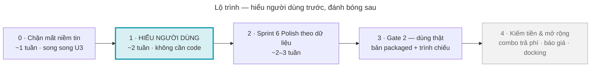

# Review sản phẩm & kế hoạch cải thiện — UE5 Interior Tool

**Phiên bản:** 1.1 | **Cập nhật:** 25/09/2026 02:25 — ghi quyết định người dùng đích của cuhoang (mục 2.0) | **Trạng thái:** PLAN — giả thuyết, CHƯA kiểm chứng với người dùng thật
**Phiên bản:** 1.0 | **Tạo:** 25/09/2026 02:06
**Góc nhìn:** Nghiên cứu người dùng (Persona / Empathy Map) · Phản biện khó tính · Tâm lý hành vi · PM / khách hàng khó tính · Cộng sự ý tưởng
**Nguồn:** ảnh màn hình tool 25/09 (`Brain/Tổng quát/ảnh/tq_UI_tong_quan.png`) · [[01_Session_State]] · [[Open_Bugs]] · [[00_Master_Plan]] · `Backend_Plan.md` · K2 `OnMouseReleased` 24/09 · kế hoạch Docking Workspace (thảo luận 16–17/09) · canvas [[1 · Một buổi dựng phòng.canvas|Một buổi dựng phòng]]

> Cách đọc: **Mục 0** đủ để nắm hết (1 phút). Mục 1–5 là lý lẽ. **Mục 6** là việc làm. **Mục 7** là kịch bản test dùng được ngay.
> Mỗi cải thiện khi đem ra làm vẫn đi đúng quy trình cũ (task card, Q10/Q9/Q8) — file này chỉ quyết **làm gì, vì sao, thứ tự nào**.

---

## 0. Đọc trong 1 phút

**Sự thật khó nghe nhất:** theo toàn bộ doc, **chưa có người dùng nào ngoài team từng dùng tool**. Mọi quyết định UX tới giờ là đoán.
`Backend_Plan.md` còn treo câu "beta bao nhiêu người, lấy từ đâu". Kiến trúc bên trong đã rất kỹ (Undo, K2, bản đồ não) — phần
chưa được kiểm chứng là **người dùng có làm được việc của họ không**.

**Đề xuất:** trước khi đánh bóng thêm (Sprint 6 Polish), dành ~2 tuần **cho 5 người thật làm 5 nhiệm vụ** và đo. Việc này không cần
viết code, chạy song song U3 được. Kết quả sẽ quyết Sprint 6 làm gì — thay vì làm theo danh sách đoán.

**3 việc làm ngay (Phase 0, ~1 tuần):** chặn các lỗi làm mất niềm tin — tool "đơ" sau Ctrl+Z giữa lúc kéo (nghi từ K2), thất bại im
lặng không báo, màu trên bảng không khớp màu trên đồ (cần test), tên kỹ thuật `BP_FurnitureActor_C_0` lộ ra màn hình.

**1 quyết định cần mày chốt trước tiên:** *bản đầu tiên phục vụ ai?* (mục 2) — mọi thứ khác xếp theo câu này.

---

## 1. Người phản biện khó tính — 4 điều phải nhìn thẳng

| # | Nhận định | Bằng chứng | Hệ quả nếu lờ đi |
|---|---|---|---|
| 1 | Chưa ai ngoài team dùng thử | Không doc nào ghi buổi test người dùng; `Backend_Plan` còn hỏi "beta lấy từ đâu" | Đánh bóng đúng thứ người dùng không cần |
| 2 | Người dùng đích ≠ giao diện hiện tại | Master Plan: "người không biết kiến trúc/vật liệu"; màn hình dùng chữ của người làm 3D: *Slot, MATERIAL EDIT, RESET SLOT, snap 0.1*, gizmo* | Người dùng đích bí ngay bước ⑤ |
| 3 | Người dùng đích "đại trà" ≠ phần cứng UE5 | Tool là app UE5 packaged, cần GPU rời; khách phổ thông dùng laptop văn phòng / điện thoại | Không cài được = không có người dùng, dù UX tốt |
| 4 | Nguồn doanh thu chính chưa có nền pháp lý | Combo trả phí = revenue chính; thỏa thuận thương mại với đồng nghiệp **CHƯA CHỐT** | Xây kho combo xong không bán được |

Không phải lời chê: nền kỹ thuật chắc là tài sản thật (Undo tin cậy chính là thứ người dùng cần nhất ở tool thiết kế — xem mục 3).
Vấn đề là **cán cân**: đã đầu tư rất nhiều vào "bên trong", gần như chưa đầu tư vào "người dùng có làm được không".

---

## 2. Nghiên cứu người dùng — ai dùng, họ cần gì

### 2.0 Quyết định của cuhoang (25/09/2026) — người dùng đích
> **Đại trà = người có kỹ năng thiết kế & tư vấn nội thất tốt, dễ tiếp cận công nghệ** — không phải người mù công nghệ, và **không phải
> nhân viên FOFF**. Gần P2 bên dưới nhưng là người ngoài công ty (nhà thiết kế / tư vấn độc lập, studio nhỏ, người bán nội thất).
> Hệ quả: nhận định 3 ở mục 1 (phần cứng) nhẹ đi — nhóm này thường đã có máy chạy SketchUp / 3ds Max / render. Nhận định 2 vẫn còn:
> họ giỏi thiết kế nhưng không phải dân Unreal → vẫn cần nói bằng ngôn ngữ nghề nội thất, không bằng ngôn ngữ engine.
> cuhoang chưa đổi cấu trúc code / kế hoạch sprint theo review này — chỉ lưu tư duy để áp dụng về sau (`Brain/Tư duy/`).

### 2.1 Ba persona giả thuyết (chưa kiểm chứng — Phase 1 sẽ xác nhận/loại)

| | **P1 · Chị Lan — chủ nhà** | **P2 · Anh Minh — tư vấn showroom / sales FOFF** ⭐ | **P3 · Tuấn — designer 3D FOFF** |
|---|---|---|---|
| Việc cần xong | Thấy phòng mình đẹp trước khi mua đồ | Chốt đơn: cho khách xem 2–3 phương án trong vài phút | Dựng nhanh, chính xác, tái dùng bộ đồ |
| Biết 3D? | Không | Ít | Thành thạo |
| Máy | Laptop văn phòng, điện thoại | PC showroom có GPU | Workstation |
| Sợ nhất | Làm hỏng, mất công, không hiểu | Máy đơ / crash **trước mặt khách** | Mất chính xác, thao tác lặp |
| Cần nhất từ tool | Bắt đầu từ phòng mẫu, ít nút | Combo + đổi màu nhanh + ảnh đẹp + báo giá | Snap, phím tắt, nhóm, combo |
| Hợp với bản hiện tại? | Thấp (phần cứng + từ ngữ) | **Trung bình → cao** | Cao |

**Đề xuất persona chính cho bản đầu: P2.** Lý do: chạy được trên máy có sẵn (PC showroom), gần doanh thu nhất (combo, chốt đơn),
và buổi demo là nơi tool tạo ấn tượng mạnh nhất. P3 là người dùng phụ (dùng hằng ngày, test giỏi). P1 để sau khi có web/stream.

### 2.2 Empathy map — P2 (giả thuyết, sẽ thay bằng dữ liệu thật sau Phase 1)

| Nói | Nghĩ |
|---|---|
| "Chị xem thử bộ sofa màu kem nhé" · "Cái này giá bao nhiêu em?" | "Khách sốt ruột rồi" · "Đừng đơ lúc này" |
| **Làm** | **Cảm thấy** |
| Mở phòng mẫu → kéo combo → đổi màu → chụp ảnh gửi Zalo | Áp lực thời gian, sợ bẽ mặt khi lỗi, tự hào khi khách "wow" |

- **Nỗi đau:** nhiều nút lạ, không biết đã lưu chưa, 4 nút Reset không rõ khác nhau, cửa sổ che mất căn phòng.
- **Điều mong đạt:** khách gật đầu, gửi được ảnh + báo giá ngay trong buổi.

### 2.3 Công việc thật người dùng "thuê" tool làm (Jobs-to-be-done)
1. *"Khi khách còn phân vân, giúp tôi cho họ **thấy** phương án khác trong 1 phút."*
2. *"Khi khách chịu, giúp tôi **mang về** thứ gì đó: ảnh đẹp, danh sách đồ, giá."*
3. *"Khi tôi làm sai, giúp tôi **quay lại** ngay, không ai nhận ra."*

---

## 3. Soi app qua mắt người dùng — 16 vấn đề (xếp theo mức độ)

Nguyên lý tâm lý viết tắt: **LA** loss aversion (sợ mất hơn thích được) · **VS** visibility of system status (hệ thống phải nói nó
đang làm gì) · **RR** recognition over recall (nhìn là nhận ra, không phải nhớ) · **HL** Hick's law (càng nhiều lựa chọn càng chậm)
· **FL** Fitts's law (mục tiêu nhỏ/xa = khó bấm) · **PE** peak-end (người ta nhớ đỉnh cảm xúc và đoạn kết) · **PS** an toàn tâm lý để
thử (có Undo tin được thì mới dám thử) · **MM** mental model (người dùng nghĩ theo "bề mặt/màu", không theo "slot/param").

### P0 — mất niềm tin / mất công (sửa trước khi cho ai dùng)
| # | Người dùng gặp gì | Bằng chứng | NL | Hướng xử lý |
|---|---|---|---|---|
| F1 | Không chắc đã lưu chưa; không thấy nút Lưu cảnh rõ ràng | Canvas 1 bước ⑦ để "?" — chính người viết doc cũng không chỉ ra được nút | LA | Nút Lưu luôn thấy + tự lưu định kỳ + dòng "Đã lưu 10:32" |
| F2 | Tool "đơ": click đồ không chọn được, camera không xoay | K2 `OnMouseReleased` 24/09: dọn cờ chỉ chạy sau CaptureSnapshot → nghi kẹt `bIsDraggingGizmo` khi Ctrl+Z giữa lúc kéo | VS, PE | Test 1 phút → nếu đúng, dọn cờ ở mọi nhánh |
| F3 | Crash / lỗi ngay trong buổi demo | Gate 1.5 C5 còn lỗi runtime ở bản packaged; GPU crash Streamline | PE | Gate 2 smoke; ẩn tính năng chưa vững khỏi bản demo |
| F4 | Bấm mà không có gì xảy ra, không báo vì sao | `Bug-SaveComboSilentBlock` (combo <2 món bị chặn im lặng); tiền lệ `Bug-MaterialPrimaryOnly` | VS | Luật: **mọi lần chặn phải có toast** nói lý do + cách làm |
| F5 | Màu trên bảng ≠ màu trên đồ | Ảnh 25/09: ô Màu sắc `FF0000FF` (đỏ), mặt bàn vẫn đen | MM | Test: kéo sang trắng. Bug → sửa; do màu nhân vân gỗ → ghi rõ "màu phủ lên vân gỗ" |
| F6 | Undo xong mất vùng vật liệu đang chọn, bảng Material trống | `Bug-ParamUndo-SlotContextLost` (đang làm U3) | PS | U3 (giữ nguyên) |

### P1 — hiểu sai / lạc đường
| # | Người dùng gặp gì | Bằng chứng | NL | Hướng xử lý |
|---|---|---|---|---|
| F7 | Không hiểu chữ: Slot, MATERIAL EDIT, RESET SLOT, param, "0.1*" | Ảnh 25/09 | MM | Bảng thuật ngữ người dùng: *Vùng vật liệu · Chỉnh chi tiết · Khôi phục vùng này* (G8 "nhãn Việt" làm luôn) |
| F8 | Anh–Việt lẫn lộn trên 1 màn hình | "FURNITURE WAREHOUSE" cạnh "Đặt lại thông số" | HL | Chọn 1 ngôn ngữ mặc định cho bản đầu; `i18n_Plan.md` có sẵn khung |
| F9 | 4 nút Reset ở 2 nơi, nghĩa chồng nhau | RESET ALL · RESET SLOT (kho) + Đặt lại thông số · Đặt lại vật liệu (bảng) | HL | Gom về bảng Material, 2 nút rõ nghĩa + nhắc "Ctrl+Z để quay lại" |
| F10 | 2 quả cầu vùng vật liệu giống hệt nhau (đen) — không biết quả nào là mặt bàn | Ảnh 25/09 | RR | Rê chuột → hiện tên vùng + tô sáng vùng đó trên đồ (stencil đã có sẵn) |
| F11 | Tiêu đề bảng hiện `BP_FurnitureActor_C_0` | Ảnh 25/09 | MM | Hiện tên sản phẩm (`VieName` từ DataTable) |
| F12 | Thanh công cụ chỉ có icon; ⇄ khó đoán; icon trên thẻ (⇄ ℹ ♡) rất nhỏ | Ảnh 25/09 | FL, RR | Tooltip có phím tắt; tăng vùng bấm |
| F13 | Ở tab FURNITURE click đồ → bảng Material không đổi theo | Ground-truth 17/09: tab Material là "cổng" của ngữ cảnh vật liệu | MM | Tách ngữ cảnh vật liệu khỏi tab (đã có trong kế hoạch Docking, phase Polish) |

### P2 — bố cục / thiếu giá trị
| # | Người dùng gặp gì | Bằng chứng | NL | Hướng xử lý |
|---|---|---|---|---|
| F14 | Cửa sổ kho + bảng Material che ~40% màn hình — che đúng thứ khách cần nhìn | Ảnh 25/09 (945×547 + 390×680 trên 1919×1079) | PE | Chế độ trình chiếu (ẩn UI); dài hạn Docking Workspace |
| F15 | Bắt đầu từ phòng trống giữa kho 100k–200k món → ngợp | `UE5_InteriorTool_Overview` | HL | Phòng mẫu + combo gợi ý làm điểm xuất phát |
| F16 | Không có gì để "mang về" sau buổi làm | Không có tính năng ảnh đẹp / chia sẻ / báo giá | PE | Chụp ảnh 1 nút → sau đó báo giá |

---

## 4. PM / khách hàng khó tính — 8 câu phải trả lời được

1. **Bản đầu phục vụ ai?** (P1 / P2 / P3 — đề xuất P2)
2. **Họ dùng ở đâu, trên máy gì?** (quyết định có cần web/stream không)
3. **Ai trả tiền, cho cái gì?** (license tool? từng combo? dịch vụ dựng phòng?)
4. **Thỏa thuận combo với đồng nghiệp chốt khi nào?** (chặn Phase 4)
5. **Ngày đầu tiên một người ngoài team dùng thử là ngày nào?**
6. **Họ đang dùng gì thay thế, vì sao sẽ đổi sang mình?** (tool web miễn phí? SketchUp + render? PowerPoint + ảnh catalogue?)
7. **Thành công của bản đầu đo bằng gì?** (đề xuất bên dưới)
8. **Cái gì KHÔNG làm trong 2 tháng tới?** (giữ phạm vi)

**4 chỉ số đề xuất cho bản đầu** (đo ở Phase 1 làm mốc, đo lại sau Phase 2):
| Chỉ số | Cách đo | Mục tiêu |
|---|---|---|
| Thời gian tới phòng đầu tiên | Mở tool → phòng có ≥5 món + 1 lần đổi vật liệu + lưu được | ≤ 10 phút với người mới |
| Tỉ lệ làm xong nhiệm vụ | 5 nhiệm vụ mục 7 | ≥ 4/5 mỗi người |
| Không crash | Buổi 30 phút | 0 crash, 0 lần "đơ" |
| Điểm SUS | 10 câu mục 7.4 | ≥ 68 (mức trung bình ngành) |

---

## 5. Cộng sự ý tưởng — kho ý tưởng xếp theo ICE

ICE = **I**mpact (tác động) × **C**onfidence (độ chắc sẽ đúng) × **E**ase (độ dễ), mỗi mục 1–5. Chấm khi CHƯA có dữ liệu người
dùng → Confidence thấp có chủ ý; chấm lại sau Phase 1.

| Ý tưởng | Giải vấn đề | I | C | E | ICE |
|---|---|---|---|---|---|
| Tự lưu + dòng "Đã lưu lúc…" | F1 | 5 | 5 | 4 | **100** |
| Toast cho mọi lần chặn | F4 | 4 | 5 | 5 | **100** |
| Chế độ trình chiếu (ẩn UI, camera xoay chậm quanh phòng) | F14, JTBD 1 | 5 | 4 | 4 | **80** |
| Chụp ảnh đẹp 1 nút (độ phân giải cao, lưu thư mục) | F16, JTBD 2 | 5 | 4 | 4 | **80** |
| Bảng thuật ngữ người dùng + 1 ngôn ngữ | F7, F8 | 4 | 5 | 4 | **80** |
| Rê vùng vật liệu → tên + tô sáng trên đồ | F10 | 4 | 4 | 4 | **64** |
| Bảng Lịch sử có tên thao tác (accessor U2.6 đã có) | PS, JTBD 3 | 3 | 4 | 4 | 48 |
| Hướng dẫn 3 bước lần đầu + phím `?` hiện bảng phím tắt | F12 | 3 | 4 | 4 | 48 |
| Phòng mẫu để bắt đầu | F15 | 4 | 3 | 3 | 36 |
| Báo giá tự động từ đồ trong phòng | JTBD 2 | 5 | 3 | 2 | 30 |
| So sánh phương án A/B (bật tắt 2 bản) | JTBD 1 | 4 | 3 | 2 | 24 |
| Combo trả phí có xem thử (watermark) | Doanh thu | 5 | 2 | 2 | 20 |
| Xem từ xa qua web / Pixel Streaming | Nhận định 3 | 5 | 2 | 1 | 10 |

Ý tưởng để ngỏ (chưa chấm): phong cách phối sẵn (Scandinavian, Indochine…) · gợi ý phối đồ tự động · đo kích thước trực tiếp trong phòng.

---

## 6. Kế hoạch — 5 phase

| Phase | Làm gì | Ai | Thời gian | Xong khi |
|---|---|---|---|---|
| **0 · Chặn mất niềm tin** | Test + sửa F2 · toast cho F4 · test F5 · tên sản phẩm F11 · nhánh "Scale" so nhầm enum (K2 24/09) | cuhoang làm, Claude dẫn | ~1 tuần, song song U3 | 3 test 1 phút PASS; không còn thất bại im lặng đã biết |
| **1 · Hiểu người dùng** ⭐ | 1.1 trả lời 8 câu mục 4 (1 buổi với Claude) · 1.2 chốt persona · 1.3 mời 5 người · 1.4 chạy kịch bản mục 7 · 1.5 tổng hợp | cuhoang chạy test, Claude soạn + tổng hợp | ~2 tuần, không cần code | Có số đo mốc + top 10 vấn đề xếp theo *tần suất × mức độ* + empathy map thật |
| **2 · Sprint 6 Polish theo dữ liệu** | Làm top 5 từ Phase 1 (dự kiến F1, F7–F10, F12) + chạy lại đúng 5 nhiệm vụ | như cũ (task card, Q10/Q9/Q8) | ~2–3 tuần | Thời gian tới phòng đầu tiên giảm ≥ 30% so với mốc |
| **3 · Gate 2 — dùng thật** | Bản packaged cho 1 điểm dùng thật (showroom / FOFF) + chế độ trình chiếu + chụp ảnh | | theo Gate 2 | 3 buổi demo thật, không crash |
| **4 · Kiếm tiền & mở rộng** | Combo trả phí (sau khi chốt thỏa thuận) · báo giá · Docking Workspace · cloud | | sau Gate 2 | 1 nơi dùng hằng tuần hoặc 1 khoản trả tiền đầu tiên |

**Sprint 7 còn lại — đề xuất xếp lại (mày quyết):**
- **Giữ:** U3 (chính là F6 — an toàn tâm lý khi thử), nhưng giới hạn ~1 tuần. G8 "từ điển thật + nhãn Việt" (trùng F7).
- **Để sau Phase 1, tùy dữ liệu:** T5 (áp thông số cho cả cụm), G9 (vân gạch). Chưa ai chứng minh người dùng cần — nếu 5 người
  không ai đụng tới thì tiết kiệm được vài tuần.

---

## 7. Kịch bản test người dùng — dùng được ngay

### 7.1 Chuẩn bị (1 lần)
- Bản build chạy ổn (PIE sạch cũng được cho vòng đầu), phòng trống giống nhau cho mọi người.
- Ghi hình màn hình + tiếng (OBS). Đồng hồ bấm giờ. 1 phiếu ghi / người (bảng 7.3).
- 5 người: 2 designer FOFF · 1–2 người tư vấn/bán hàng · 1–2 người ngoài ngành. **5 người thường đủ lộ ra phần lớn vấn đề lớn** —
  đông hơn chủ yếu lặp lại cái đã thấy.

### 7.2 Lời mở đầu (đọc nguyên văn)
> "Hôm nay mình thử **phần mềm**, không phải thử bạn — bạn không thể làm sai. Trong lúc làm bạn cứ **nói to** điều đang nghĩ.
> Mình sẽ **không giúp** trong lúc bạn làm; bí quá thì bạn nói *bỏ qua*."

### 7.3 Năm nhiệm vụ (cố tình KHÔNG dùng chữ trên giao diện để khỏi mớm)
| # | Đọc cho người thử | Đo |
|---|---|---|
| N1 | "Bạn muốn đặt một chiếc sofa vào góc phòng này." | xong? · giây · số lần bí |
| N2 | "Xoay sofa quay ra giữa phòng và đặt sát tường." | như trên |
| N3 | "Mặt bàn này bạn muốn đổi sang gỗ màu sáng hơn." | như trên · có tìm ra vùng mặt bàn không |
| N4 | "Có người đã chuẩn bị sẵn một bộ phòng khách — hãy đưa cả bộ vào phòng." | như trên |
| N5 | "Bạn phải đi rồi — làm sao để mai mở lại vẫn thấy phòng này?" | như trên · có tìm thấy nút lưu không |
| N6 *(tùy chọn)* | "Bạn lỡ tay làm sai — hãy đưa về như cũ." | có nghĩ tới Ctrl+Z không |

Ghi thêm cho mỗi nhiệm vụ: **câu nói đáng chú ý (nguyên văn)** · chỗ click sai · chỗ dừng lại lâu > 5 giây.

### 7.4 Sau test — SUS (10 câu, 1 = rất không đồng ý … 5 = rất đồng ý)
1. Tôi nghĩ tôi sẽ muốn dùng phần mềm này thường xuyên. 2. Phần mềm phức tạp không cần thiết. 3. Phần mềm dễ dùng.
4. Tôi sẽ cần người kỹ thuật hỗ trợ mới dùng được. 5. Các chức năng gắn kết với nhau tốt. 6. Có quá nhiều chỗ không nhất quán.
7. Hầu hết mọi người sẽ học dùng rất nhanh. 8. Dùng rất vướng víu. 9. Tôi thấy tự tin khi dùng. 10. Tôi phải học nhiều thứ trước khi dùng được.
**Tính điểm:** câu lẻ lấy (điểm − 1), câu chẵn lấy (5 − điểm), cộng lại × 2.5 → thang 0–100.

Thêm 3 câu mở: *"Chỗ nào khó chịu nhất?"* · *"Được thêm 1 thứ, bạn muốn gì?"* · *"Bạn có dùng cái này thay cho cách bạn đang làm không — vì sao?"*

### 7.5 Tổng hợp (Claude làm)
Mỗi vấn đề ghi: bao nhiêu người gặp (tần suất) × làm hỏng nhiệm vụ hay chỉ chậm (mức độ) → xếp top 10 → đối chiếu với F1–F16 ở
mục 3 (cái nào đúng, cái nào đoán sai, cái nào mới) → cập nhật persona + empathy map thật → chấm lại ICE.

---

## 8. Cần mày trả lời (theo thứ tự)
1. ~~Bản đầu phục vụ P1, P2 hay P3?~~ → **đã chốt 25/09**: người thiết kế / tư vấn ngoài công ty (mục 2.0)
2. Mời được **5 người** nào trong 2 tuần tới?
3. Đồng ý **xếp lại Sprint 7** như mục 6 không (giữ U3 + G8, dời T5 + G9)?
4. Thỏa thuận combo với đồng nghiệp — dự kiến chốt khi nào?

---

## Lịch sử
| Phiên bản | Ngày | Nội dung |
|---|---|---|
| 1.0 | 25/09/2026 02:06 | Tạo mới — review 5 góc nhìn + kế hoạch 5 phase + kịch bản test. Giả thuyết, chưa có dữ liệu người dùng. |
| 1.1 | 25/09/2026 02:25 | +mục 2.0 quyết định người dùng đích (cuhoang); câu hỏi 1 mục 8 đã trả lời. |
